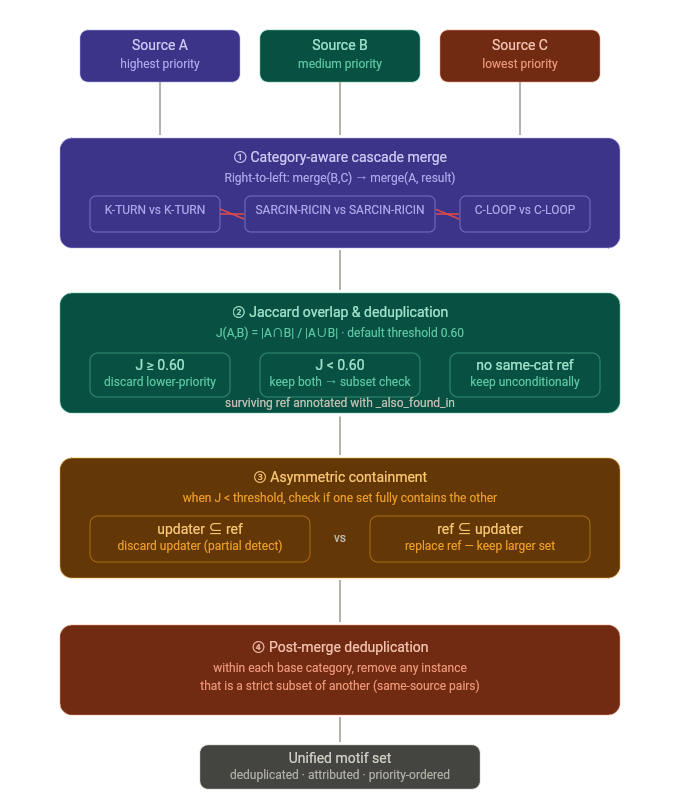

# RSMViewer — Developer Guide

Technical reference for developers working on the RSMViewer PyMOL plugin.

---

## Table of Contents

1. [Architecture Overview](#1-architecture-overview)
2. [Project Structure](#2-project-structure)
3. [Initialization Flow](#3-initialization-flow)
4. [Command Reference](#4-command-reference)
5. [Data Sources & Providers](#5-data-sources--providers)
6. [Chain ID System](#6-chain-id-system)
7. [Multi-Source Pipeline](#7-multi-source-pipeline)
8. [Color System](#8-color-system)
9. [Image Export](#9-image-export)
10. [Caching](#10-caching)
11. [Adding a New Data Source](#11-adding-a-new-data-source)
12. [Key Classes & Methods](#12-key-classes--methods)

---

## 1. Architecture Overview

```
PyMOL
├── plugin.py              Entry point (__init_plugin__)
├── gui.py                 Command registration & GUI state (MotifVisualizerGUI)
├── loader.py              Visualization pipeline (StructureLoader, UnifiedMotifLoader, VisualizationManager)
├── alignment.py           Medoid superimposition pipeline (rmv_super / rmv_align)
├── colors.py              90+ motif color definitions + custom color support
├── image_saver.py         PNG export with 8 representations
├── structure_exporter.py  mmCIF export (original coordinates from disk)
├── database/
│   ├── config.py          SOURCE_ID_MAP (7 sources), SourceMode, PluginConfig
│   ├── base_provider.py   ResidueSpec, MotifInstance, MotifType, BaseProvider ABC
│   ├── registry.py        DatabaseRegistry — lazily loads providers
│   ├── atlas_provider.py  Atlas JSON provider
│   ├── rfam_provider.py   Rfam Stockholm provider
│   ├── bgsu_api_provider.py  Hybrid HTML scraping + CSV fallback (~3000+ PDBs)
│   ├── rfam_api_provider.py  Rfam API (34 motif families, RM00001–RM00034)
│   ├── source_selector.py  Smart source selection with fallback chain
│   ├── source_registry.py  Source registry
│   ├── cascade_merger.py   Category-aware merge with Jaccard dedup (≥60%)
│   ├── homolog_enricher.py NR representative lookup for semantic enrichment
│   ├── cache_manager.py    30-day disk cache at ~/.rsmviewer_cache/
│   ├── converters.py       Format converters for provider outputs
│   ├── representative_set.py NR list loader
│   ├── nrlist_4.24_all.csv   BGSU NR representative list
│   └── user_annotations/
│       ├── user_provider.py  FR3D/RMS/RMSX annotation loader
│       └── converters.py     User annotation format parsers
└── utils/
    ├── logger.py          PluginLogger with colored PyMOL console output
    ├── parser.py          PDB ID + selection string parsers
    └── selectors.py       3-layer chain ID protection for PyMOL selections
```

### Data Flow

```
rmv_fetch <PDB>  →  PyMOL cmd.fetch() / cmd.load()
                     →  store loaded_pdb / loaded_pdb_id
                     →  parse CIF for auth→label chain map (if cif_use_auth=0)

rmv_db <N>       →  set source mode + provider config in GUI state

rmv_load_motif   →  dispatch to:
                     ├── Single source (local/web):
                     │   └── fetch_motif_data_action()
                     │       └── source_selector → provider.get_motifs() → store
                     ├── User source (5–7):
                     │   └── load_user_annotations_action()
                     │       └── user_provider.load_annotations() → parse → store
                     └── Combine mode (multiple sources):
                         └── _load_combined_motifs()
                             └── fetch each → enrich → stamp → dedup → cascade merge → store

rmv_show <TYPE>  →  VisualizationManager.show_motif_type()
                     └── create PyMOL objects + color selections

rmv_view <TYPE>  →  gui.view_motif_action()
                     └── color residues in-place on structure (no objects)

rmv_super <TYPE> →  alignment.py → MedoidSuperimposer
                     └── pairwise RMSD matrix → medoid → cmd.super all onto medoid

rmv_save <TYPE>  →  ImageSaver.save_motif_images()
                     └── render + ray + png for each instance

rmv_save <TYPE> cif  →  StructureExporter.export_instance()
                     └── parse original CIF → filter _atom_site → write mmCIF
```

---

## 2. Project Structure

### Source Code Files

| File | Lines | Purpose |
|------|-------|---------|
| `gui.py` | ~4260 | Main GUI class, 22 command registrations (20 direct + 2 from alignment), state management |
| `loader.py` | ~2060 | StructureLoader, UnifiedMotifLoader, VisualizationManager |
| `alignment.py` | ~990 | Medoid superimposition pipeline (rmv_super / rmv_align) |
| `image_saver.py` | ~580 | PNG export for individual motif instances + current view |
| `structure_exporter.py` | ~520 | mmCIF export — extracts original coordinates from disk CIF |
| `colors.py` | ~420 | MOTIF_COLORS dict (90+ entries), custom overrides, dynamic pool, PyMOL color application |
| `plugin.py` | ~120 | Entry point, cif_use_auth lock, welcome banner |
| `__init__.py` | ~43 | Package metadata (version 1.0.0), lazy imports |

### Database Module

| File | Lines | Purpose |
|------|-------|---------|
| `config.py` | ~247 | SOURCE_ID_MAP (7 entries), SourceMode enum, PluginConfig dataclass |
| `base_provider.py` | ~362 | ABC for all providers: ResidueSpec, MotifInstance, MotifType, BaseProvider |
| `registry.py` | ~302 | DatabaseRegistry — discovers and registers providers |
| `atlas_provider.py` | ~278 | Parses bundled Atlas JSON files (7 motif types: HL, IL, J3–J7) |
| `rfam_provider.py` | ~251 | Parses bundled Rfam Stockholm/SEED files (19 motif types) |
| `bgsu_api_provider.py` | ~714 | Hybrid: HTML scraping from rna.bgsu.edu + CSV fallback for loop data |
| `rfam_api_provider.py` | ~346 | REST API calls to Rfam for 34 motif family annotations |
| `source_selector.py` | ~301 | Routes source selection to appropriate provider(s) |
| `source_registry.py` | ~141 | Source registry |
| `cascade_merger.py` | ~527 | Merges motifs from multiple sources with Jaccard deduplication |
| `homolog_enricher.py` | ~463 | Enriches generic motif names using NR homolog representatives |
| `cache_manager.py` | ~405 | Disk cache with 30-day expiry, version 2.1, auto-invalidation |
| `converters.py` | ~499 | Converts provider-specific output to unified MotifInstance format |
| `representative_set.py` | ~221 | Loads BGSU NR representative list for homolog lookup |

### User Annotations

| File | Lines | Purpose |
|------|-------|---------|
| `user_provider.py` | ~552 | Unified provider for FR3D, RMS, RMSX |
| `converters.py` | ~787 | FR3D CSV parser, RMS tab parser, RMSX log parser |

### Utils Module

| File | Lines | Purpose |
|------|-------|---------|
| `logger.py` | ~82 | `PluginLogger` — colored console output (info/warning/error/success/debug) |
| `parser.py` | ~147 | Parses PDB IDs, file paths, selection strings |
| `selectors.py` | ~366 | 3-layer chain ID protection: builds safe PyMOL selection strings |

---

## 3. Initialization Flow

When PyMOL loads the plugin (`__init_plugin__` in `plugin.py`):

1. **Logger setup** — `initialize_logger(use_pymol_console=True)`
2. **Welcome banner** — prints ASCII box with version (1.0.0), available sources, and quick start guide
3. **Chain ID lock** — `cmd.set("cif_use_auth", 1)` — ensures auth_asym_id by default
4. **Registry init** — `initialize_registry()` — registers Atlas and Rfam providers
5. **GUI init** — `initialize_gui()` — creates `MotifVisualizerGUI`, registers all 22 commands via `cmd.extend()`, and calls `register_alignment_commands()` for `rmv_super`/`rmv_align`

---

## 4. Command Reference

All commands are registered via `cmd.extend()`. 20 are registered directly in `gui.py`, 2 are registered in `alignment.py` via `register_alignment_commands()`.

### Loading & Data

#### `rmv_fetch <PDB_ID> [, cif_use_auth=0|1] [, bg_color=COLOR]`

Downloads and loads a PDB/mmCIF structure. Does NOT fetch motif data.

**Implementation:** `fetch_raw_pdb()` in `gui.py`

**Key behavior:**
- Accepts PDB IDs (4 alphanumeric characters) or local file paths (`.pdb`, `.cif`, `.mmcif`, `.pdb.gz`, `.cif.gz`, `.ent`, `.ent.gz`)
- Local paths detected by: path separators, `~` prefix, `.` prefix, or file extensions
- Regex-parses `cif_use_auth=` and `bg_color=` from raw input (PyMOL space-separation workaround)
- `cif_use_auth` accepts: `0`/`off`/`false`/`label` or `1`/`on`/`true`/`auth`
- Sets `cmd.set("cif_use_auth", val)` before `cmd.fetch()` / `cmd.load()`
- If `cif_use_auth=0`: calls `_build_auth_label_chain_mapping()` to parse CIF `_atom_site` loop
- Stores `loaded_pdb`, `loaded_pdb_id`, `auth_to_label_map` on GUI object
- When switching to a different PDB, clears stale motif data and `loaded_sources`
- Reports chains found (up to 20 displayed, remainder counted)

```
rmv_fetch 1S72
rmv_fetch 1S72, cif_use_auth=0
rmv_fetch 1S72, bg_color=white
rmv_fetch /path/to/local.cif
rmv_fetch ~/structures/1s72.pdb
```

---

#### `rmv_load_motif`

Fetches motif data from the currently selected source for the loaded PDB. Takes no arguments.

**Implementation:** `load_motif_data()` → dispatches to:
- `fetch_motif_data_action()` for curated sources (1–4)
- `load_user_annotations_action()` for user sources (5–7)
- `_load_combined_motifs()` for combine mode

**Prerequisites:** A PDB must be loaded (`rmv_fetch`) and a source selected (`rmv_db`).

---

#### `rmv_db <N> [N ...] [on|off] [MOTIF P_VALUE ...] [/path/to/data] [, jaccard_threshold=VALUE]`

Sets the active data source. Supports multi-source combine, P-value filtering, and custom data paths.

**Implementation:** `select_database()` → `_handle_source_by_id()` / `_handle_combine_sources()`

**Source IDs:**

| ID | Provider | Type |
|----|----------|------|
| 1 | RNA 3D Motif Atlas | Local |
| 2 | Rfam | Local |
| 3 | BGSU RNA 3D Hub | Web API |
| 4 | Rfam API | Web API |
| 5 | FR3D | User annotations |
| 6 | RNAMotifScan (RMS) | User annotations + filtering |
| 7 | RNAMotifScanX (RMSX) | User annotations + filtering |

**Multi-source detection:** When remaining args after the first source ID contain another valid source ID, combine mode is triggered.

**Jaccard threshold parsing:** Values >1.0 treated as percentages (e.g., `80` → `0.80`). Trailing `%` stripped. Default: `0.60`.

**Custom paths:** Detected by presence of `/` or `\`. Stored per-source in `self.user_data_paths: Dict[int, str]`.

```
rmv_db 3                                    # Single source
rmv_db 6 7                                  # Combine RMS + RMSX
rmv_db 6 7, jaccard_threshold=0.80          # Custom threshold
rmv_db 6 off                                # Disable filtering
rmv_db 6 SARCIN-RICIN 0.01                  # Custom P-value
rmv_db 7 /path/to/rmsx/data                 # Custom data path
```

---

#### `rmv_source info [N]`

Shows currently active source info (no args) or detailed info about source N.

**Implementation:** `set_source(mode='info')` → `_handle_source_info_command()`

---

#### `rmv_sources`

Lists all 8 available data sources with descriptions and coverage.

**Implementation:** `list_sources()` → `gui.print_sources()`

---

#### `rmv_refresh`

Force-refreshes motif data from API sources (bypasses 30-day cache).

**Implementation:** `refresh_motifs()` → `gui.refresh_motifs_action()`

---

#### `rmv_load <PDB_ID>`

**Legacy command.** Does NOT load anything — only prints a "RECOMMENDED WORKFLOW" guide directing users to `rmv_fetch` → `rmv_db` → `rmv_load_motif`.

---

### Visualization

#### `rmv_show <TYPE> [<INSTANCE_NO>] [, padding=N]`

Creates PyMOL objects for motif instances and renders them.

**Implementation:** `show_motif()` → `_resolve_motif_type_and_instance()` → `VisualizationManager.show_motif_type(padding=N)` or `.show_motif_instance(padding=N)`

**Key behavior:**
- Uses `_resolve_motif_type_and_instance()` to handle multi-word motif names (e.g., `"4-WAY JUNCTION (J4)"`)
- Creates PyMOL objects with source suffix: `HL_ALL_S3`, `HL_1_S3`
- Auto-deactivates all other PyMOL objects except the base PDB and new motif objects
- With instance number: creates separate object, zooms camera, prints residue details
- Supports comma-separated instance numbers: `rmv_show HL 1,3,5`
- Includes typo detection with "Did you mean…?" suggestions

**Source filtering (combine mode only):**

In combine mode, the last non-numeric token is checked as a source filter keyword via `_resolve_source_filter()`:

```
rmv_show K-TURN rms          # Only RMS-unique instances
rmv_show K-TURN shared       # Only shared instances
```

Supported keywords: `rmsx`, `rms`, `fr3d`, `rfam`, `atlas`, `bgsu`, `shared`, plus full source names.

---

#### `rmv_show ALL`

Creates PyMOL objects for every loaded motif type.

---

#### `rmv_view <TYPE> [<INSTANCE_NO>] | all | hide | all hide | <TYPE> hide`

Lightweight alternative — highlights motif residues directly on the structure **without** creating separate PyMOL objects.

**Implementation:** `view_motif()` → `gui.view_motif_action()`

- `rmv_view all` — colors all motif residues with unique type colors
- `rmv_view hide` / `rmv_view all hide` — resets all coloring to gray
- `rmv_view <TYPE> hide` — resets only that type's coloring
- `rmv_view <TYPE> <NO>` — zooms and creates a PyMOL selection

---

#### `rmv_toggle <TYPE> on|off`

Toggles visibility of a motif type's PyMOL objects.

**Implementation:** `toggle_motif()` → `gui.toggle_motif_action()`

Accepted values: `on`/`true`/`1`/`yes`/`show` or `off`/`false`/`0`/`no`/`hide`

---

#### `rmv_bg_color <COLOR>`

Changes the color of non-motif residues (default: `gray80`).

---

#### `rmv_color <TYPE> <COLOR>`

Changes the color of a specific motif type. Accepts PyMOL color names or RGB float values.

**Implementation:** `set_motif_color()` → `colors.set_custom_motif_color()` → re-applies via `set_motif_color_in_pymol()`

Custom colors take priority over predefined colors.

---

#### `rmv_colors`

Prints the color legend for all loaded (or default) motif types.

---

### Superimposition

#### `rmv_super <TYPE> [<INSTANCE_NOS>] [, <PDB_SRC1>, <PDB_SRC2>] [, padding=N]`

Medoid-based structural superimposition using `cmd.super()` (sequence-independent).

**Implementation:** `superimpose_motifs()` → `alignment.py` → `_run_medoid_pipeline()`

**Pipeline:**
1. Resolve motif name via alias table + fuzzy matching (exact → alias → reverse alias → substring)
2. Collect individual instance objects (auto-create if needed via `_batch_create_instance_objects()`)
3. Build N×N pairwise RMSD matrix using temporary copies
4. Identify medoid (instance with minimum average RMSD)
5. Superimpose all instances onto medoid
6. Color each instance uniquely (cycling 15 colors), medoid = green
7. Print formatted report with per-instance RMSD

**PDB_SRC tags:** Format `<PDB>_S<N>` (e.g., `1S72_S3`). Validated with intelligent error messages.

**Motif alias table (`MOTIF_ALIASES`):**

| User Input | Resolves To |
|------------|-------------|
| KTURN, K_TURN, KINK-TURN, KINK_TURN | K-TURN |
| CLOOP, C_LOOP | C-LOOP |
| SARCIN, SARCINRICIN, SARCIN_RICIN | SARCIN-RICIN |
| REVERSE-KTURN, REVERSE_KTURN, REVERSEKTURN, REVERSE_K_TURN | REVERSE-K-TURN |
| ELOOP, E_LOOP | E-LOOP |
| TLOOP, T_LOOP | T-LOOP |

**Resolution order:** Exact match → Forward alias → Reverse alias → Substring match

```
rmv_super KTURN                       # All K-TURN instances
rmv_super KTURN 1,3,5                 # Specific instances
rmv_super KTURN, 1S72_S3, 4V88_S3    # Cross-PDB
rmv_super KTURN, padding=3            # With flanking residues
```

---

#### `rmv_align <TYPE> [<INSTANCE_NOS>] [, <PDB_SRC1>, <PDB_SRC2>] [, padding=N]`

Same as `rmv_super` but uses `cmd.align()` (sequence-dependent). Better for closely related sequences.

---

### Information

#### `rmv_summary [TYPE] [INSTANCE_NO]`

Prints motif information to the console (no rendering).

**Implementation:** `motif_summary()` → dispatches to:
- No args: `gui.print_motif_summary()` — summary table of all types with counts
- TYPE only: `gui.show_motif_summary_for_type()` — instance table with source attribution
- TYPE + NO: `gui.show_motif_instance_summary()` — residue-level details

---

#### `rmv_chains [structure_name]`

Shows chain ID diagnostic information: structure name, `cif_use_auth` value, chain ID mode, total chain count, and all chains.

---

#### `rmv_loaded`

Lists all loaded PDB+source combination tags (e.g., `1S72_S3`, `4V88_S7`). Suggests usage with `rmv_super`/`rmv_align`.

---

#### `rmv_help`

Prints the full 22-command reference in box format.

---

### Save & Export

#### `rmv_save <ALL|TYPE|TYPE NO|current> [representation|cif] [filename]`

Saves motif instance images **or** exports motif structures as mmCIF.

**Implementation:** `save_motif_images()` → dispatches to:
- `ALL`: `gui.save_all_motif_images_action(representation)`
- `TYPE`: `gui.save_motif_type_images_action(type, representation)`
- `TYPE NO`: `gui.save_motif_instance_by_id_action(type, no, representation)`
- `current`: `gui.save_current_view_action(filename)` — 2400×1800, ~300 DPI
- `ALL cif`: `gui.export_all_motif_structures_action()`
- `TYPE cif`: `gui.export_motif_type_structures_action(type)`
- `TYPE NO cif`: `gui.export_motif_instance_by_id_action(type, no)`

**Representations (image save):** `cartoon` (default), `sticks`, `spheres`, `ribbon`, `lines`, `licorice`, `surface`, `cartoon+sticks`

**Output directories:**
- Images: `motif_images/<pdb_id>/<MOTIF_TYPE>/`
- Structures: `motif_structures/<pdb_id>/<MOTIF_TYPE>/`

**mmCIF export** extracts original coordinates from the on-disk CIF file (not PyMOL's internal coordinates). Implemented in `structure_exporter.py` → `MotifStructureExporter`.

**Why not `cmd.save()`?** PyMOL may modify coordinates slightly during loading (symmetry expansion, origin shifting). The exporter reads/writes the raw CIF text directly.

---

### User Annotations

#### `rmv_user <TOOL> <PDB_ID> | list`

Legacy command to load user annotations directly.

- `rmv_user fr3d 1S72` — Load FR3D annotations
- `rmv_user rnamotifscan 1A00` — Load RMS annotations
- `rmv_user list` — Show available annotation files

> **Preferred approach:** Use `rmv_db 5/6/7/8` + `rmv_load_motif` instead.

---

#### `rmv_reset`

Deletes all PyMOL objects (`cmd.delete('all')`) and resets all GUI state:
- Clears `loaded_pdb`, `loaded_pdb_id`, `current_source_mode`, `current_source_id`
- Resets filtering to defaults (on)
- Clears custom P-values and custom colors
- Resets `cif_use_auth` to 1
- Clears auth→label chain mapping and motif loader data

---

## 5. Data Sources & Providers

### Provider Architecture

All providers inherit from `BaseProvider` (in `base_provider.py`):

```python
class BaseProvider(ABC):
    @abstractmethod
    def get_motifs(self, pdb_id: str) -> List[MotifType]: ...

    @abstractmethod
    def get_available_pdb_ids(self) -> List[str]: ...

    @abstractmethod
    def get_available_motif_types(self) -> List[str]: ...
```

### Core Data Types

```python
@dataclass
class ResidueSpec:
    chain: str              # Chain ID (e.g., 'A')
    number: int             # Residue sequence number
    nucleotide: str = ''    # One-letter code (A, U, G, C)

@dataclass
class MotifInstance:
    residues: List[ResidueSpec]
    annotation: str = ''    # Optional label
    score: float = 0.0      # P-value for RMS/RMSX

@dataclass
class MotifType:
    name: str               # e.g., 'HL', 'GNRA', 'SARCIN-RICIN'
    instances: List[MotifInstance]
```

### Source 1 — RNA 3D Motif Atlas (Local)

- **File:** `atlas_provider.py`
- **Data:** Bundled JSON files in `motif_database/RNA 3D motif atlas/` (e.g., `hl_4.5.json`, `il_4.5.json`)
- **Motif types:** HL, IL, J3, J4, J5, J6, J7
- **Auto-discovery:** Scans for versioned JSON files at startup

### Source 2 — Rfam (Local)

- **File:** `rfam_provider.py`
- **Data:** Bundled Stockholm/SEED alignment files in `motif_database/Rfam motif database/`
- **Motif types:** 19 named types (GNRA, UNCG, CUYG, K-TURN-1, K-TURN-2, pK-TURN, T-LOOP, C-LOOP, U-TURN, SARCIN-RICIN-1, SARCIN-RICIN-2, TANDEM-GA, etc.)

### Source 3 — BGSU RNA 3D Hub (Web API)

- **File:** `bgsu_api_provider.py`
- **Strategy:** Hybrid HTML scraping + CSV fallback
  1. Scrapes `http://rna.bgsu.edu/rna3dhub/pdb/{PDB}/motifs` for loop annotations
  2. Falls back to CSV download if HTML parsing fails
- **Coverage:** ~3000+ PDB structures
- **Cache:** 30 days via `cache_manager.py`

### Source 4 — Rfam API (Web)

- **File:** `rfam_api_provider.py`
- **Endpoint:** `https://rfam.org/motif/{RM_ID}/alignment` (Stockholm SEED format)
- **Coverage:** 34 motif families (RM00001–RM00034)
- **Cache:** 30 days

### Sources 5–7 — User Annotations

- **File:** `user_annotations/user_provider.py` + `user_annotations/converters.py`
- **Source 5 (FR3D):** Parses FR3D CSV output
- **Source 6 (RMS):** Parses RNAMotifScan tab-separated result files with P-value filtering
- **Source 7 (RMSX):** Parses RNAMotifScanX `result_*.log` files with P-value filtering

**File locations (default):**
```
database/user_annotations/
├── fr3d/                    FR3D CSV files
├── RNAMotifScan/            RMS (motif-type subdirectories)
└── RNAMotifScanX/           RMSX (consensus subdirectories)
```

**Custom paths stored per-source** in `gui.user_data_paths: Dict[int, str]`.

**RMSX file priority:** When multiple result files exist in a consensus directory:
1. `result_0_100_withbs.log` (highest)
2. `result_0_100.log`
3. `result_0_withbs.log`
4. `result_0.log` (lowest)

**Default P-value thresholds:**

| Motif | RMS | RMSX |
|-------|-----|------|
| KINK-TURN | 0.07 | 0.066 |
| C-LOOP | 0.04 | 0.044 |
| SARCIN-RICIN | 0.02 | 0.040 |
| REVERSE KINK-TURN | 0.14 | 0.018 |
| E-LOOP | 0.13 | 0.018 |

---

## 6. Chain ID System

The plugin implements a **4-layer chain ID handling system** to ensure consistency between PDB structures and motif annotation data.

### Layer 1 — Startup Lock (`plugin.py`)

```python
cmd.set("cif_use_auth", 1)
```

Sets the default chain ID convention to `auth_asym_id` at plugin startup.

### Layer 2 — Fetch-Time Override (`gui.py` → `fetch_raw_pdb`)

When `cif_use_auth=0` is specified:
```python
cmd.set("cif_use_auth", 0)
gui.cif_use_auth = 0
```

### Layer 3 — CIF File Parsing (`gui.py` → `_build_auth_label_chain_mapping`)

When `cif_use_auth=0`, the plugin parses the CIF file `_atom_site` loop to build a mapping:

```python
{auth_asym_id: label_asym_id}  # e.g., {'0': 'A', '9': 'B'}
```

Stored in `gui.auth_to_label_map` and used during motif data loading to remap residue chain IDs.

**Algorithm:**
1. Find CIF file in PyMOL's `fetch_path`
2. Locate `_atom_site.auth_asym_id` and `_atom_site.label_asym_id` column indices
3. Read data rows, extract unique (auth, label) pairs
4. Return `{auth: label}` dict

### Layer 4 — Runtime Diagnostics (`rmv_chains`)

Displays current chain mode and loaded chains for verification.

### Why This Matters

Motif databases (BGSU, Atlas, Rfam) use **auth_asym_id** chain IDs. When PyMOL loads with `cif_use_auth=0`, it uses **label_asym_id** as the `chain` property. Without the mapping, motif selections would target wrong residues/chains.

---

## 7. Multi-Source Pipeline

When combining sources (e.g., `rmv_db 6 7`):

### Step 1 — Fetch

Each source independently fetches motifs for the PDB:
```
RMS  → [K-TURN(6), SARCIN-RICIN(4), ...]
RMSX → [K-TURN(5), C-LOOP(3), SARCIN-RICIN(4), ...]
```

### Step 2 — Enrich (`homolog_enricher.py`)

Generic motif names are enriched using NR homolog representative lookup:
```
Atlas HL_345 → matches BGSU GNRA_123 (same residues) → rename to GNRA
```

Uses `nrlist_4.24_all.csv` for representative set lookup. IFE format: `PDB_ID|Model|Chain` (handles multi-chain with `+`). Primary matching by `motif_group` ID; fallback via Jaccard residue similarity (threshold 0.85). Skips generic names (HL, IL, J3–J8) for enrichment.

### Step 3 — Source Stamping

Each instance is tagged with `_source_id` and `_source_label` metadata. This enables the SOURCE column in instance tables and the source attribution report in `rmv_summary`.

### Step 4 — Within-Source Deduplication

Exact duplicates within the same source are removed. Two instances are considered duplicates if they have the same set of `(chain, residue_number)` pairs.

### Step 5 — Cascade Merge (`cascade_merger.py`)

Sources are merged right-to-left, category-aware. The pairwise step runs in two phases:

**Key parameters:**
- **Phase 1 — subset containment** (always wins, ignores priority): if `updater_residues ⊆ ref_residues`, the updater is discarded; if `ref_residues ⊆ updater_residues`, the ref's residue set is replaced by the updater's larger one (kept under ref's key, ref's source label retained).
- **Phase 2 — Jaccard fallback**: only when neither side is a subset, compute Jaccard. Default threshold `0.60` (60% residue overlap = duplicate). User-configurable via `jaccard_threshold=`.
- Category-aware: only compares motifs within the same base category.
- `MOTIF_CANONICAL_MAP` harmonizes variant names (KTURN → K-TURN, CLOOP → C-LOOP, etc.).
- Surviving updater motifs are filed under the ref's key when the category has exactly one ref-side key (priority naming); otherwise they keep their own key.

### Step 6 — Cross-Source Attribution

`_annotate_overlap()` adds `_also_found_in` metadata for instances found in multiple sources. `_deduplicate_subsets()` performs a final pass removing subset instances (asymmetric containment).

### Step 7 — Source Filter Resolution

In combine mode, `_resolve_source_filter()` (`gui.py`) categorizes merged instances as **unique** (single `_source_label`) or **shared** (`_also_found_in` not empty). Keywords (rms, rmsx, nobias, shared, etc.) resolve to lists of instance numbers for per-source rendering. Aliases include the SOURCE_ID_MAP full label, the label with parenthesised shorthand stripped (`RNAMotifScanX (RMSX)` → `RNAMotifScanX`), the `tool`/`subtype` shorthand, and any individual word in the label — a longest-first multi-token scan in `show_motif` lets full names like `BGSU RNA 3D Hub` be passed without quoting.


### Storage

Merged motifs stored in `VisualizationManager.motif_loader.loaded_motifs`:
```python
{
    'K-TURN': {'count': 8, 'motif_details': [...], 'structure_name': '1s72', ...},
    'SARCIN-RICIN': {'count': 4, 'motif_details': [...], ...},
}
```

---

## 8. Color System

### Color Definitions (`colors.py`)

Colors are defined as RGB tuples normalized to 0–1:
```python
MOTIF_COLORS = {
    'HL': (1.0, 0.0, 0.0),      # Red
    'IL': (0.0, 1.0, 1.0),      # Cyan
    'J3': (1.0, 1.0, 0.0),      # Yellow
    'GNRA': (0.0, 0.8, 0.4),    # Teal green
    ...
}
```

90+ entries including underscore and hyphen aliases (e.g., both `SARCIN_RICIN` and `SARCIN-RICIN`).

### Color Priority

1. **Custom** — user-set via `rmv_color` (stored in `CUSTOM_COLORS` dict)
2. **Predefined** — from `MOTIF_COLORS`
3. **Dynamic pool** — 20 visually distinct colors assigned at runtime (`_DYNAMIC_COLOR_POOL`)
4. **Hash** — MD5 hash-based deterministic color when pool exhausted

### Constants

- `NON_MOTIF_COLOR = 'gray80'` — background/non-motif residue color
- `DEFAULT_COLOR = (1.0, 0.5, 0.0)` — bright orange for unknown types

---

## 9. Image Export

### Image Saver (`image_saver.py`)

The `ImageSaver` class handles all PNG export:

- **Instance images:** Renders each motif instance in isolation (no background structure)
  - Default size: 800×600
  - Representations: cartoon, sticks, spheres, ribbon, lines, licorice, surface, cartoon+sticks
- **Current view:** Captures the PyMOL viewport as-is
  - Size: 2400×1800, ~300 DPI

### Structure Exporter (`structure_exporter.py`)

The `MotifStructureExporter` class exports motif instances as standalone mmCIF files:

1. Locates the **original CIF file** on disk via PyMOL's `fetch_path`
2. Parses `_atom_site` column headers to find `auth_asym_id` and `auth_seq_id` indices
3. Filters atom records to only those matching the motif's (chain, residue) pairs
4. Copies all metadata blocks (`_cell`, `_symmetry`, `_entity`, etc.) from source
5. Writes a self-contained `.cif` file loadable in PyMOL or any molecular viewer

### Output Folders

```
motif_images/
└── <pdb_id>/
    ├── <MOTIF_TYPE>/
    │   ├── <TYPE>-<NO>-<CHAIN>_<RESIDUES>.png
    │   └── ...
    └── ...

motif_structures/
└── <pdb_id>/
    ├── <MOTIF_TYPE>/
    │   ├── <TYPE>-<NO>-<CHAIN>_<RESIDUES>.cif
    │   └── ...
    └── ...
```

---

## 10. Caching

### Cache Manager (`cache_manager.py`)

- **Location:** `~/.rsmviewer_cache/`
- **Expiry:** 30 days
- **Version:** `CACHE_VERSION = "2.1"` — auto-invalidates old caches
- **Scope:** API responses from BGSU (source 3) and Rfam API (source 4)
- **Bypass:** `rmv_refresh` clears cache and re-fetches

---

## 11. Adding a New Data Source

There are two integration paths depending on what the new source looks like:

| Path | When to use | Examples |
|------|-------------|---------|
| **A — Local / Web provider** | The source has its own data format and returns `MotifInstance` objects directly | RNA 3D Motif Atlas (local JSON), BGSU API (HTML scraping) |
| **B — User annotation provider** | The source is a motif-scan tool with per-structure output files that users drop in | RNAMotifScan, RNAMotifScanX, NoBIAS |

Both paths require touching the same five files: `config.py`, `registry.py` (Path A) or `user_annotations/converters.py` + `user_annotations/user_provider.py` (Path B), `gui.py`, and `colors.py`.

---

### Path A — Local or Web Provider

Use this path when you have a bundled database file or a remote API that returns motif data in a proprietary format. You implement a `BaseProvider` subclass, register it in the provider registry, then wire it into the source dispatch table.

#### A-1 — Implement `BaseProvider`

Create `rsmviewer/database/mydb_provider.py`. All seven abstract methods must be implemented; the four marked with `(*)` are the ones actually called during a normal workflow:

```python
# rsmviewer/database/mydb_provider.py
from __future__ import annotations

from pathlib import Path
from typing import Dict, List, Optional

from .base_provider import (
    BaseProvider,
    DatabaseInfo,
    DatabaseSourceType,
    MotifInstance,
    MotifType,
    ResidueSpec,
)


class MyDBProvider(BaseProvider):
    """Provider for MyDB motif database."""

    def __init__(self, database_path: str):
        super().__init__(database_path)
        self._version = '1.0'
        # Internal index: {pdb_id_upper: {motif_type: [MotifInstance, ...]}}
        self._index: Dict[str, Dict[str, List[MotifInstance]]] = {}

    # ------------------------------------------------------------------ #
    # Required: database metadata
    # ------------------------------------------------------------------ #

    @property
    def info(self) -> DatabaseInfo:
        return DatabaseInfo(
            id='mydb',
            name='MyDB Motif Database',
            description='Short description of what MyDB annotates',
            version=self._version,
            source_type=DatabaseSourceType.LOCAL_DIRECTORY,  # or API
            motif_types=list(self._motif_types.keys()),
            pdb_count=len(self._index),
        )

    # ------------------------------------------------------------------ #
    # (*) Required: called once at startup by registry.register_provider()
    # ------------------------------------------------------------------ #

    def initialize(self) -> bool:
        """Load all data files and build internal index."""
        try:
            for data_file in self.database_path.glob('*.json'):
                self._parse_file(data_file)
            self._initialized = True
            return True
        except Exception as e:
            print(f"[MYDB] Initialization failed: {e}")
            return False

    def _parse_file(self, path: Path) -> None:
        """Parse one data file and populate self._index."""
        import json
        with open(path) as fh:
            data = json.load(fh)
        for entry in data.get('instances', []):
            pdb = entry['pdb_id'].upper()
            motif_type = entry['type'].upper()         # e.g. 'K-TURN', 'GNRA'
            residues = [
                ResidueSpec(
                    chain=r['chain'],
                    residue_number=int(r['number']),
                    nucleotide=r.get('nucleotide', ''),
                    insertion_code=r.get('insertion_code', ''),
                    model=int(r.get('model', 1)),
                )
                for r in entry.get('residues', [])
            ]
            instance = MotifInstance(
                instance_id=entry['id'],              # unique within source
                motif_id=motif_type,
                pdb_id=pdb,
                residues=residues,
                annotation=entry.get('annotation', motif_type),
                metadata={
                    # Keep source-native extras here; the loader will add
                    # _source_id / _source_label when stamping in step 2.5
                    'score': entry.get('score'),
                    'motif_group': entry.get('group_id', ''),
                },
            )
            self._index.setdefault(pdb, {}).setdefault(motif_type, []).append(instance)

    # ------------------------------------------------------------------ #
    # (*) Required: called by _fetch_from_single_source() in gui.py
    # ------------------------------------------------------------------ #

    def get_motifs_for_pdb(self, pdb_id: str) -> Dict[str, List[MotifInstance]]:
        """Return all motifs for a PDB — the main retrieval entry-point."""
        return self._index.get(pdb_id.upper(), {})

    # ------------------------------------------------------------------ #
    # (*) Required: used by rmv_summary / registry bookkeeping
    # ------------------------------------------------------------------ #

    def get_available_pdb_ids(self) -> List[str]:
        return sorted(self._index.keys())

    def get_available_motif_types(self) -> List[str]:
        types = set()
        for motifs in self._index.values():
            types.update(motifs.keys())
        return sorted(types)

    # ------------------------------------------------------------------ #
    # Required (rarely called directly, but needed by ABC)
    # ------------------------------------------------------------------ #

    def get_motif_type(self, type_id: str) -> Optional[MotifType]:
        instances = [
            inst
            for pdb_motifs in self._index.values()
            for inst in pdb_motifs.get(type_id.upper(), [])
        ]
        if not instances:
            return None
        mt = MotifType(type_id=type_id.upper(), name=type_id.upper(), source='mydb')
        mt.instances = instances
        return mt

    def get_motif_residues(
        self, pdb_id: str, motif_type: str, instance_id: str
    ) -> List[ResidueSpec]:
        for inst in self._index.get(pdb_id.upper(), {}).get(motif_type.upper(), []):
            if inst.instance_id == instance_id:
                return inst.residues
        return []
```

> **Important:** `get_motifs_for_pdb()` must return `{motif_type_string: [MotifInstance, ...]}`. The keys must be uppercase strings that match the color definitions you will add in step A-5.

For a **web/API provider**, the same interface applies. Use `urllib.request` or `requests` to fetch data in `initialize()` or lazily in `get_motifs_for_pdb()`, and cache responses via `cache_manager`:

```python
class MyAPIProvider(BaseProvider):
    def __init__(self, cache_manager=None):
        super().__init__('')             # no local path needed
        self.cache_manager = cache_manager

    def get_motifs_for_pdb(self, pdb_id: str) -> Dict[str, List[MotifInstance]]:
        pdb_id = pdb_id.upper()
        # Try cache first
        if self.cache_manager:
            cached = self.cache_manager.get_cached(pdb_id, 'mydb_api')
            if cached:
                return cached
        # Fetch
        data = self._fetch_from_api(pdb_id)
        motifs = self._parse_api_response(data)
        # Store to cache
        if self.cache_manager and motifs:
            self.cache_manager.cache(pdb_id, 'mydb_api', motifs)
        return motifs
```

#### A-2 — Register in `SOURCE_ID_MAP`

Edit `rsmviewer/database/config.py`. The `type` and `subtype` fields are load-bearing: they drive the dispatch in `_fetch_from_single_source()`.

```python
# config.py  —  inside SOURCE_ID_MAP = { ... }
9: {
    'name': 'MyDB Motif Database',
    'type': 'local',              # 'local' | 'web'
    'category': 'LOCAL SOURCES',  # displayed by rmv_sources
    'subtype': 'mydb',            # MUST match the key used in registry.register_provider()
    'description': 'MyDB (bundled, offline)',
    'coverage': '~500 PDB structures',
    'mode': 'local',
    'command': 'rmv_db 9',
},
```

For a web/API source use `'type': 'web'` and note that the dispatch in `gui.py` maps `subtype` through `web_map`:

```python
# In _fetch_from_single_source() in gui.py  (see step A-4):
web_map = {'bgsu': 'bgsu_api', 'rfam_api': 'rfam_api', 'mydb': 'mydb_api'}
```

So a web source with `'subtype': 'mydb'` must be registered as `'mydb_api'` in the registry.

#### A-3 — Register Provider in `registry.py`

Edit the `initialize_registry()` function in `rsmviewer/database/registry.py` to import and register your provider:

```python
# registry.py — inside initialize_registry()

# ======================================
# LOCAL PROVIDERS (add after existing ones)
# ======================================
mydb_path = db_path / 'MyDB'     # adjust to actual directory name
if mydb_path.exists():
    from .mydb_provider import MyDBProvider
    mydb_provider = MyDBProvider(str(mydb_path))
    registry.register_provider(mydb_provider, 'mydb')   # key = subtype in config.py
```

For a web/API provider (no `database_path`):

```python
if enable_api:
    try:
        from .mydb_api_provider import MyAPIProvider
        mydb_api = MyAPIProvider(cache_manager=cache_manager)
        registry.register_provider(mydb_api, 'mydb_api')  # key = web_map value
    except Exception as e:
        print(f"Note: MyDB API provider not available ({e})")
```

After this, the provider is available in `source_selector.providers` automatically, because `initialize_source_selector(registry.get_all_providers(), ...)` is called at the end of `initialize_registry()`.

#### A-4 — Wire the Dispatch in `gui.py`

The function `_fetch_from_single_source()` in `rsmviewer/gui.py` is the single dispatch point. For most local and web sources the existing code already handles the mapping by reading `info.get('subtype')`, so you only need to act if your subtype needs a non-trivial name mapping (e.g., `'mydb'` → `'mydb_api'` for web):

```python
# gui.py — inside _fetch_from_single_source(), in the 'web' branch
web_map = {
    'bgsu': 'bgsu_api',
    'rfam_api': 'rfam_api',
    'mydb': 'mydb_api',      # ← add this line
}
```

No changes are needed for `'local'` sources — the `subtype` is used directly as the provider key.

If your source introduces a new `type` value (not `'local'`, `'web'`, or `'user'`), you also need to add a branch to `_fetch_from_single_source()`:

```python
elif source_type == 'mytype':
    from .database.mydb_provider import MyDBProvider
    provider = MyDBProvider(...)
    return provider.get_motifs_for_pdb(pdb_id)
```

#### A-5 — Add Color Definitions

Edit `rsmviewer/colors.py`. Any motif type your provider returns that is not in `MOTIF_COLORS` will fall back to orange. Add specific colors:

```python
# colors.py — inside MOTIF_COLORS = { ... }
'MY-MOTIF-TYPE':   (0.2, 0.6, 1.0),   # blue
'MY-MOTIF-TYPE-2': (0.9, 0.4, 0.1),   # orange-red
```

Add underscore aliases if the type name contains hyphens (both are looked up):

```python
'MY_MOTIF_TYPE':   (0.2, 0.6, 1.0),   # underscore alias
```

#### A-6 — (Optional) Handle Generic Names

If your provider returns generic names (e.g., `HL`, `IL`, `J3`) that should be enriched via the homolog pipeline, add those names to `GENERIC_SOURCES` in `_load_combined_motifs()` in `gui.py`:

```python
# gui.py — _load_combined_motifs()
GENERIC_SOURCES = {1, 3, 5, 9}   # ← add your source ID
```

And if it returns new generic name strings not currently in `GENERIC_NAMES`, add them to `homolog_enricher.py`:

```python
# homolog_enricher.py
GENERIC_NAMES: Set[str] = {
    'HL', 'IL', 'J3', ...
    'MY-GENERIC-NAME',   # ← add here
}
```

---

### Path B — User Annotation Provider

Use this path when the new source produces per-run output files that users place in the `user_annotations/` directory. The plugin loads those files when `rmv_db <N>` + `rmv_load_motif` is called.

#### B-1 — Write a Format Parser

Add a parser class to `rsmviewer/database/user_annotations/converters.py`. Follow the existing pattern for `RMSXConverter`:

```python
# user_annotations/converters.py

class MyToolConverter:
    """Parse MyTool output files for a given PDB."""

    # Default P-value thresholds per motif type (leave empty if no filtering)
    DEFAULT_PVALUE_THRESHOLDS: Dict[str, float] = {
        'K-TURN': 0.05,
        'SARCIN-RICIN': 0.02,
    }

    def parse_file(self, filepath: Path, pdb_id: str) -> Dict[str, List[MotifInstance]]:
        """
        Parse a single MyTool result file.

        Returns:
            {motif_type: [MotifInstance, ...]}
        """
        results: Dict[str, List[MotifInstance]] = {}
        with open(filepath) as fh:
            for line in fh:
                if line.startswith('#'):
                    continue
                parts = line.strip().split('\t')
                if len(parts) < 4:
                    continue
                motif_type = parts[0].upper()
                chain       = parts[1]
                residues_raw = parts[2].split(',')   # e.g. ["101", "102", "103"]
                p_value     = float(parts[3])

                residues = [
                    ResidueSpec(chain=chain, residue_number=int(r.strip()))
                    for r in residues_raw
                ]
                instance = MotifInstance(
                    instance_id=f"mytool_{pdb_id}_{motif_type}_{len(results.get(motif_type, []))+1}",
                    motif_id=motif_type,
                    pdb_id=pdb_id.upper(),
                    residues=residues,
                    annotation=motif_type,
                    metadata={'p_value': p_value, 'source': 'mytool'},
                )
                results.setdefault(motif_type, []).append(instance)
        return results

    def apply_pvalue_filter(
        self,
        motifs: Dict[str, List[MotifInstance]],
        custom_thresholds: Optional[Dict[str, float]] = None,
    ) -> Dict[str, List[MotifInstance]]:
        thresholds = {**self.DEFAULT_PVALUE_THRESHOLDS, **(custom_thresholds or {})}
        filtered = {}
        for mtype, instances in motifs.items():
            cutoff = thresholds.get(mtype.upper())
            if cutoff is None:
                filtered[mtype] = instances
            else:
                filtered[mtype] = [
                    inst for inst in instances
                    if inst.metadata.get('p_value', 1.0) <= cutoff
                ]
        return filtered
```

#### B-2 — Hook into `UserAnnotationProvider`

Edit `rsmviewer/database/user_annotations/user_provider.py` so the new tool is recognised:

```python
# user_provider.py — in UserAnnotationProvider.get_motifs_for_pdb() or a helper

from .converters import MyToolConverter   # ← import

# Inside the dispatch that calls tool-specific converters:
elif self.active_tool == 'mytool':
    converter = MyToolConverter()
    # Discover result files — adapt glob pattern to your tool's naming scheme
    tool_dir = self.tool_dirs.get('MyTool', self.root_dir / 'MyTool')
    result_files = list(tool_dir.glob(f'{pdb_id}*.txt'))
    for f in result_files:
        partial = converter.parse_file(f, pdb_id)
        if self.apply_mytool_filtering:
            partial = converter.apply_pvalue_filter(
                partial, self.mytool_custom_pvalues
            )
        for mtype, instances in partial.items():
            motifs.setdefault(mtype, []).extend(instances)
```

#### B-3 — Register in `SOURCE_ID_MAP`

```python
# config.py
9: {
    'name': 'MyTool Annotations',
    'type': 'user',                # must be 'user'
    'category': 'USER ANNOTATIONS',
    'tool': 'mytool',              # MUST match active_tool string in user_provider.py
    'description': 'MyTool analysis output (custom user files)',
    'coverage': 'Custom uploads',
    'mode': 'user',
    'command': 'rmv_db 9',
    'supports_filtering': True,    # set True to enable rmv_db 9 on|off
    'command_with_filtering': 'rmv_db 9 [on|off]',
    'command_with_custom_pvalues': 'rmv_db 9 MOTIF_NAME p_value ...',
},
```

#### B-4 — Add Filtering State to `gui.py`

`_fetch_from_single_source()` in `gui.py` already handles the `user` type by calling `UserAnnotationProvider.set_active_tool(tool)`. For P-value filtering, add the state and wiring analogous to the existing `user_nobias_*` block:

```python
# gui.py — __init__ of MotifVisualizerGUI

self.user_mytool_filtering_enabled = True
self.user_mytool_custom_pvalues: Dict[str, float] = {}

# gui.py — in _fetch_from_single_source(), user-type branch

elif tool_lower in ['mytool']:
    provider.apply_mytool_filtering = self.user_mytool_filtering_enabled
    provider.set_mytool_custom_pvalues(self.user_mytool_custom_pvalues)
```

Also add parsing of the `on|off` and custom P-value arguments in `_handle_source_by_id()` by following the `source_id == 8` (NoBIAS) block as a template.

#### B-5 — Place Data Files

Create the expected directory for the tool's files:

```
rsmviewer/database/user_annotations/
└── MyTool/
    ├── 1S72_results.txt
    └── 4V88_results.txt
```

The user can override this location at runtime with:

```
rmv_db 9 /absolute/path/to/MyTool/data
```

#### B-6 — Add Color Definitions

Same as Path A step A-5 — add entries to `MOTIF_COLORS` in `colors.py`.

---

### End-to-End Checklist

| Step | File(s) touched | Path A | Path B |
|------|----------------|--------|--------|
| Write provider / parser | `database/mydb_provider.py` or `user_annotations/converters.py` | ✓ | ✓ |
| Register source | `database/config.py` (SOURCE_ID_MAP) | ✓ | ✓ |
| Register provider | `database/registry.py` | ✓ | — |
| Hook user_provider | `user_annotations/user_provider.py` | — | ✓ |
| Extend web_map (web only) | `gui.py` (`_fetch_from_single_source`) | web only | — |
| Add filtering state | `gui.py` (MotifVisualizerGUI) | — | if P-values |
| Add generic-name support | `gui.py` + `homolog_enricher.py` | if generic names | — |
| Add color definitions | `colors.py` | ✓ | ✓ |
| Data directory | `motif_database/` or `user_annotations/` | ✓ | ✓ |

---

## 12. Key Classes & Methods

### `MotifVisualizerGUI` (`gui.py`)

The central state object. Key attributes:

| Attribute | Type | Purpose |
|-----------|------|---------|
| `loaded_pdb` | `str` | PyMOL object name of loaded structure |
| `loaded_pdb_id` | `str` | PDB ID (uppercase, e.g., "1S72") |
| `cif_use_auth` | `int` | 1 = auth_asym_id, 0 = label_asym_id |
| `auth_to_label_map` | `dict` | {auth_chain: label_chain} mapping |
| `current_source_mode` | `str` | 'local', 'web', 'user', 'combine' |
| `current_source_id` | `int\|str` | Numeric source ID (1–7) or combined (e.g., '6_7') |
| `combined_source_ids` | `list` | Source IDs when combining |
| `user_rms_filtering_enabled` | `bool` | RMS P-value filtering on/off |
| `user_rmsx_filtering_enabled` | `bool` | RMSX P-value filtering on/off |
| `user_rms_custom_pvalues` | `dict` | {motif_name: p_value} overrides |
| `user_rmsx_custom_pvalues` | `dict` | {motif_name: p_value} overrides |
| `user_data_paths` | `dict` | Per-source custom data paths: {source_id: path_str} |
| `viz_manager` | `VisualizationManager` | Manages loading + rendering |

### `VisualizationManager` (`loader.py`)

Coordinates structure loading, motif loading, and visualization:

| Method | Purpose |
|--------|---------|
| `show_motif_type(type, padding=0)` | Render all instances of a motif type |
| `show_motif_instance(type, no, padding=0)` | Render + zoom to specific instance |
| `show_all_motifs()` | Reset to default colored view |
| `get_structure_info()` | Returns loaded PDB info + motif counts |
| `_deactivate_other_objects(keep_active)` | Auto-deactivate PyMOL objects except those in `keep_active` |
| `_format_source_label(metadata)` | Format `_source_label` + `_also_found_in` for display |

### `_build_auth_label_chain_mapping(pdb_id)` (`gui.py`)

Parses CIF file `_atom_site` loop to extract auth→label chain mapping. Used when `cif_use_auth=0`.

### `_resolve_motif_type_and_instance(full_arg, instance_arg)`

Handles multi-word motif type names (e.g., "4-WAY JUNCTION (J4) 1"):
1. Checks if args match a loaded motif type exactly
2. Tries splitting the last token as an instance number
3. Returns `(motif_type, instance_no_or_None)`

### `_resolve_source_filter(keyword, combined_source_ids)`

In combine mode, resolves keywords like `rms`, `rmsx`, `shared` to lists of instance numbers matching that source or overlap category.

---

## Conventions

- **PDB IDs** are stored uppercase (`loaded_pdb_id`) but PyMOL object names are lowercase (`loaded_pdb`)
- **Source suffixes** appended to PyMOL object names: `_S3` (single), `_S_6_7` (combined)
- **Motif type names** are uppercase internally (e.g., `HL`, `GNRA`, `SARCIN-RICIN`)
- **Color aliases** cover both underscore and hyphen variants (e.g., `SARCIN_RICIN` and `SARCIN-RICIN`)
- **Chain ID convention** defaults to `auth_asym_id` (cif_use_auth=1)

---

*RSMViewer v1.0.0 — CBB LAB KU @Dr. Zhong*
