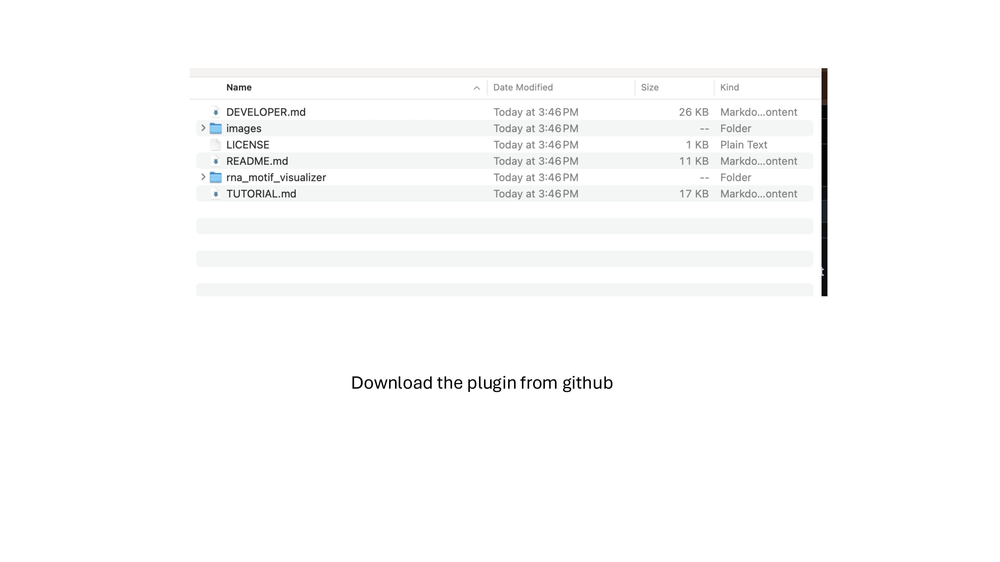
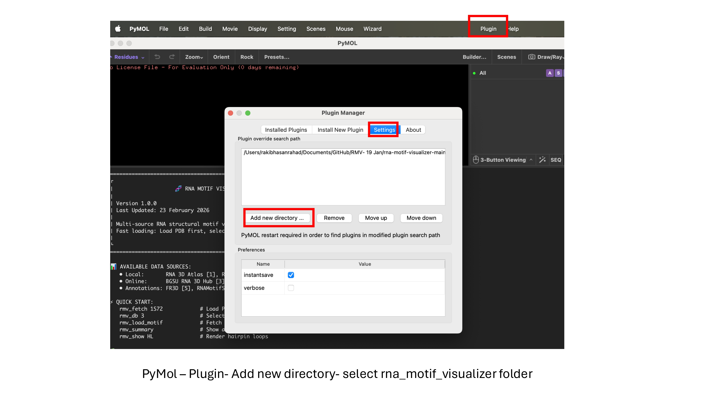
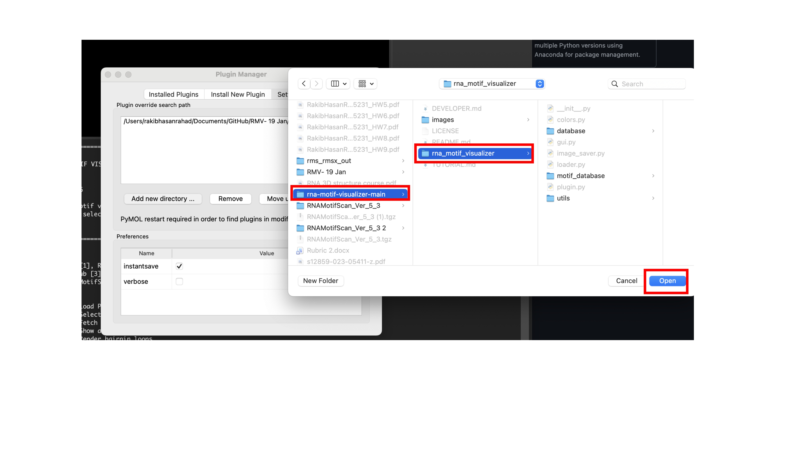
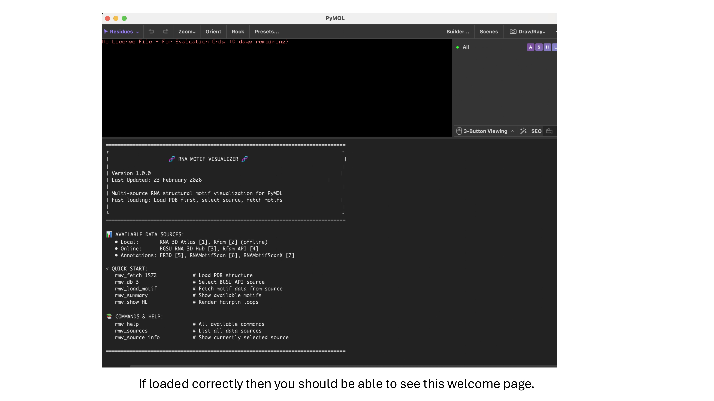

# RNA Motif Visualizer

**A PyMOL plugin for automated visualization and comparative analysis of RNA structural motifs**

[](LICENSE)


---

## Overview

RNA Motif Visualizer is a PyMOL plugin designed for structural biologists and computational RNA researchers. It automates the detection, visualization, and comparative analysis of RNA structural motifs. The plugin integrates multiple data sources (BGSU RNA 3D Motif Atlas, Rfam, FR3D, RNAMotifScan) to enable rapid annotation validation, multi-database comparison, and high-quality batch image generation.

**Key innovation:** A unified framework that standardizes heterogeneous RNA motif annotations across multiple databases and tools, enabling automated, structurally consistent visualization and comparative analysis within PyMOL.

---
## 📦 Installation

### Step 1: Download

```bash
git clone https://github.com/Rakib-Hasan-Rahad/rna-motif-visualizer.git
```

Or download the [ZIP file](https://github.com/Rakib-Hasan-Rahad/rna-motif-visualizer/archive/refs/heads/main.zip) and extract.

### Step 2: Install in PyMOL

1. Open **PyMOL**
2. Go to **Plugin → Plugin Manager**
3. Click the **Settings** tab
4. Click **Add new directory**
5. Navigate to and select the **`rna_motif_visualizer`** folder
6. Click **OK** and restart PyMOL

### Step 3: Verify Installation

You should see in the PyMOL terminal:

```
[SUCCESS] RNA Motif Visualizer GUI initialized
```

---

## � Installation Screenshots

**Figure 1: Plugin Manager — Add Directory**


**Figure 2: Select rna_motif_visualizer Folder**


**Figure 3: Plugin Installed Successfully**


**Figure 4: PyMOL Ready with RNA Motif Visualizer**


---

## �🚀 Quick Start

### 1. See All Available Commands

```
rmv_help
```

### 2. Load a Structure & Visualize Motifs

```
rmv_fetch 1S72           # Download 23S rRNA structure
rmv_db 3                 # Select BGSU API source
rmv_load_motif           # Fetch motif data
rmv_summary              # Show available motifs
rmv_show HL              # Highlight hairpin loops
```

### 3. Explore Individual Instances

```
rmv_show GNRA 1          # Zoom to first GNRA instance
rmv_show GNRA 2          # Switch to second instance
```

### 4. Compare Data Sources

```
rmv_db 3                 # BGSU API
rmv_load_motif           # Fetch from BGSU
rmv_db 4                 # Rfam API (no re-download!)
rmv_load_motif           # Fetch from Rfam
```

### 5. Export Images

```
rmv_save current         # Save high-res PNG of current view
rmv_save ALL             # Batch export all motif instances
```

---

## 📖 Complete Command Reference

### Loading & Data Management

| Command | Description |
|---------|-------------|
| `rmv_fetch <PDB_ID>` | Fetch PDB structure (no motif data) |
| `rmv_fetch <PDB_ID> cif_use_auth=0` | Load with mmCIF label chain IDs |
| `rmv_load_motif` | Fetch motif data from selected source |
| `rmv_db <N>` | Select data source by ID (1-7) |
| **`rmv_db <N> /path/to/data` | Select source with custom data path (5–7)**
| `rmv_sources` | List all available sources with descriptions |
| `rmv_load <PDB_ID>` | Load structure with auto-visualization |
| `rmv_refresh` | Force re-fetch from API (bypass cache) |

### Visualization & Navigation

| Command | Description |
|---------|-------------|
| `rmv_show <MOTIF_TYPE>` | Highlight all instances of motif type |
| `rmv_show <MOTIF_TYPE> <NO>` | Zoom to specific instance #NO |
| `rmv_show ALL` | Show all motif types with objects |
| `rmv_toggle <MOTIF_TYPE> on/off` | Show/hide motif type |
| `rmv_color <MOTIF_TYPE> <COLOR>` | Change motif color at runtime |
| `rmv_colors` | Display color legend |
| `rmv_bg_color <COLOR>` | Change background color |

### Information & Diagnostics

| Command | Description |
|---------|-------------|
| `rmv_summary` | Show motif type counts |
| `rmv_summary <MOTIF_TYPE>` | Show instances of specific type |
| `rmv_chains` | Show chain IDs + CIF mode status |
| `rmv_source info` | Show currently active source |
| `rmv_source info <N>` | Detailed info about a specific source |
| `rmv_reset` | Delete all objects & reset plugin to defaults |
| `rmv_help` | Full command reference |

### User Annotations

| Command | Description |
|---------|-------------|
| `rmv_user <TOOL> <PDB_ID>` | Load FR3D/RMS/RMSX annotations directly |
| `rmv_db 6 off` | Disable RMS P-value filtering |
| `rmv_db 6 on` | Enable RMS P-value filtering |
| `rmv_db 6 MOTIF 0.01` | Set custom P-value threshold |

### Image Export

| Command | Description |
|---------|-------------|
| `rmv_save current` | Export current PyMOL view as PNG (~300 dpi) |
| `rmv_save ALL` | Batch export all motif instances |
| `rmv_save <TYPE> <NO> [rep]` | Save specific instance with representation |

---

## 🎨 Data Sources

### Online (Real-time, 3000+ Structures)

| Source | Command | Coverage | Update Frequency |
|--------|---------|----------|-----------------|
| **BGSU RNA 3D Hub** | `rmv_db 3` | ~3000+ PDB structures | Weekly |
| **Rfam** | `rmv_db 4` | Named motifs (GNRA, K-turn, etc.) | Monthly |

### Offline (Bundled, Pre-computed)

| Source | Command | Motif Types | Size |
|--------|---------|-------------|------|
| **RNA 3D Motif Atlas** | `rmv_db 1` | 7 types (HL, IL, J3-J7, PSEUDOKNOT) | ~5 MB |
| **Rfam Local** | `rmv_db 2` | 19 named motifs | ~2 MB |

### User-Provided (Custom Annotations)

| Source | Command | Description |
|--------|---------|-------------|
| **FR3D** | `rmv_db 5` | FR3D analysis output (custom user files) |
| **RNAMotifScan** | `rmv_db 6` | RNAMotifScan output with P-value filtering |
| **RNAMotifScanX** | `rmv_db 7` | RNAMotifScanX output with P-value filtering |

Custom data paths supported:
```
rmv_db 5 /path/to/fr3d/data
rmv_db 6 ~/my_rms_data
rmv_db 7 /path/to/rmsx/data
```

---

## 🔗 Chain ID Handling

The plugin automatically handles both PDB and mmCIF chain ID conventions:

### Default Mode (auth_asym_id)
```
rmv_fetch 1S72          # Chains: 0, 9, A, B, ... (author-assigned)
```

### Label ID Mode (label_asym_id)
```
rmv_fetch 1S72 cif_use_auth=0    # Chains: A, AA, AB, ... (PDB-standardized)
```

**Use label mode when:**
- Working with mmCIF files where PDB standardization is required
- Using data sources annotated with label_asym_id 

---

## 💾 Caching & Performance

API responses are cached for **30 days** at:
```
~/.rna_motif_visualizer_cache/
```

**Benefits:**
- Second load of same structure: <1 second
- Offline access after first fetch
- Reduced server load

**Clear cache manually:**
```bash
rm -rf ~/.rna_motif_visualizer_cache/
```

---

## 📊 Example Workflows

### Workflow 1: Validate Computational Predictions

```python
# In PyMOL:
rmv_fetch 1S72
rmv_db 5                        # Select FR3D annotations
rmv_load_motif                   # Load FR3D data
rmv_show "INTERNAL LOOP"        # View your predictions
rmv_save ALL                    # Export for validation report
```

### Workflow 2: Compare Multiple Databases

```python
rmv_fetch 4V88                  # Ribosomal LSU
rmv_db 3                        # Select BGSU
rmv_load_motif
rmv_summary KINK-TURN           # BGSU: 12 instances
rmv_show KINK-TURN

# Now switch to Rfam
rmv_db 4                        # Switch to Rfam API
rmv_load_motif
rmv_summary KINK-TURN           # Rfam: 8 instances (different definition)
rmv_show KINK-TURN

# Assess differences
```

### Workflow 3: Generate Publication Figures

```python
rmv_fetch 1S72
rmv_db 3                        # Select BGSU
rmv_load_motif
rmv_show "SARCIN-RICIN"
cmd.hide("ribbon")
cmd.show("sticks")
rmv_save current                # ~300 dpi PNG ready for journal
```

---
**Reset everything:**
```python
rmv_reset                # Delete all objects & reset plugin state
rmv_fetch 1S72           # Start fresh
```

---

## 📚 Documentation

| Document | Purpose |
|----------|---------|
| [TUTORIAL.md](TUTORIAL.md) | Step-by-step walkthroughs with examples |
| [DEVELOPER.md](DEVELOPER.md) | Architecture, command implementation, how to extend |
| **README.md** | This file — overview and quick start |

---

## 🗂️ Project Structure

```
rna-motif-visualizer/
├── rna_motif_visualizer/
│   ├── __init__.py                  # Package init, version info
│   ├── plugin.py                    # PyMOL plugin entry point
│   ├── gui.py                       # Command handlers (18 commands)
│   ├── loader.py                    # Rendering & visualization logic
│   ├── colors.py                    # Motif color definitions
│   ├── database/
│   │   ├── base_provider.py         # Abstract data source interface
│   │   ├── bgsu_provider.py         # BGSU API integration
│   │   ├── rfam_provider.py         # Rfam API integration
│   │   ├── local_provider.py        # Bundled offline database
│   │   ├── user_annotations/        # FR3D, RNAMotifScan, custom CSVs
│   │   ├── cache.py                 # 30-day API response cache
│   │   └── motif_definitions.py     # Motif type taxonomy
│   ├── motif_database/              # Offline data (7 MB)
│   │   ├── atlas/                   # RNA 3D Motif Atlas (~5 MB)
│   │   └── rfam/                    # Rfam motifs (~2 MB)
│   └── utils/
│       ├── selectors.py             # PyMOL selection building
│       ├── chain_converter.py        # auth ↔ label chain mapping
│       └── logger.py                # Console logging
├── README.md                        # This file
├── TUTORIAL.md                      # Step-by-step guide
├── DEVELOPER.md                     # Developer guide
├── LICENSE                          # MIT License
└── .gitignore
```

---

## 📄 License

MIT License — see [LICENSE](LICENSE) file.

---

##  Acknowledgments

- **BGSU RNA 3D Hub** — Comprehensive RNA motif annotations and structure database
- **Rfam Database** — Conserved RNA family and motif definitions
- **RNA 3D Motif Atlas** — Historical RNA motif taxonomy and structure analysis
- **PyMOL** — Schrödinger, LLC; molecular visualization platform
- **RNAMotifScan & FR3D** — Community tools for motif annotation

## 🐛 Troubleshooting

| Problem | Solution |
|---------|----------|
| Plugin not appearing | Verify you selected `rna_motif_visualizer` folder (not parent directory) in Plugin Manager |
| No motifs found | Try `rmv_db 1` (local) or check structure is in PDB database |
| API errors | Check internet connection; try `rmv_db 2` (local only) |
| Slow first load | Normal—API call + caching. Second load is instant |
| Chain ID mismatch in annotations | Use `rmv_fetch <ID> cif_use_auth=0` for label ID mode |
| Session not saving | Save as `.pse` (PyMOL Session) before `rmv_save` |

## 📧 Support

- **Issues & Bug Reports:** [GitHub Issues](https://github.com/Rakib-Hasan-Rahad/rna-motif-visualizer/issues)
- **Documentation:** [TUTORIAL.md](TUTORIAL.md) and [DEVELOPER.md](DEVELOPER.md)
- **Questions:** Open a GitHub Discussion

---

**Happy RNA Visualization! 🧬**

*Transform structural biology with automated, reproducible motif analysis.*
