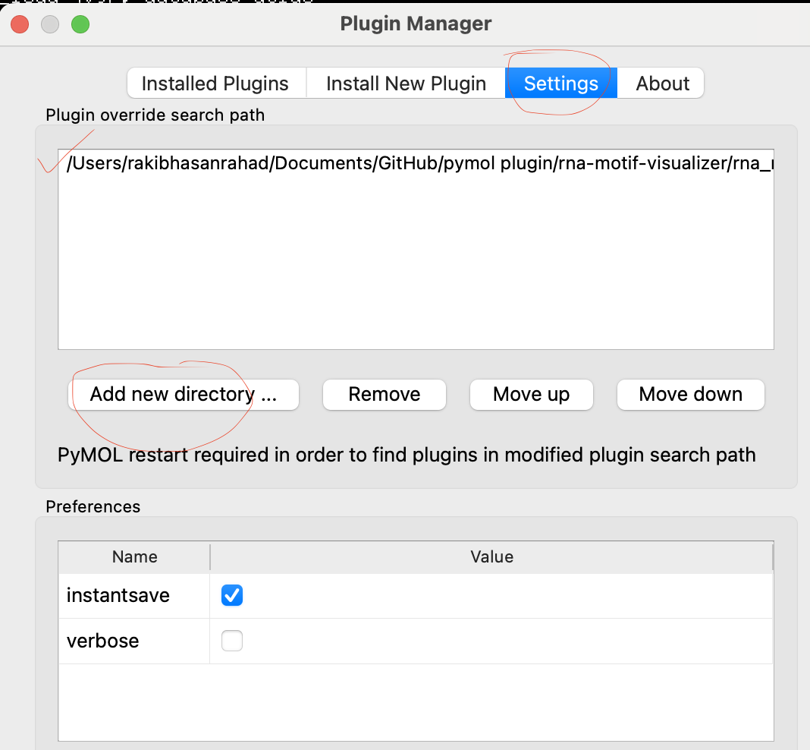
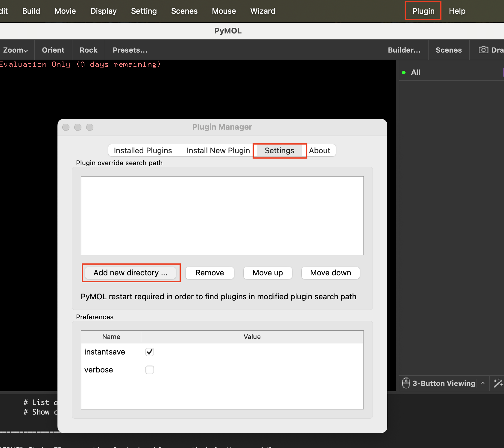
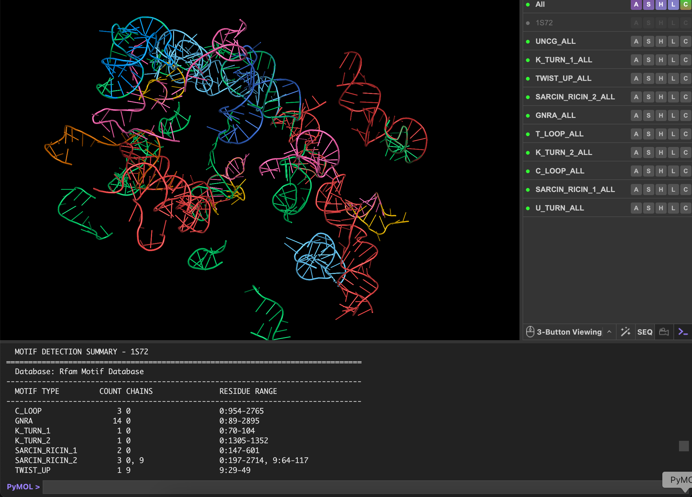

# RNA Motif Visualizer

A PyMOL plugin for visualizing RNA structural motifs. It automatically detects and highlights RNA motifs like hairpin loops, internal loops, junctions, GNRA tetraloops, kink-turns, and many others directly on your RNA structure.

This plugin works with multiple motif databases - the RNA 3D Motif Atlas and the Rfam Motif Database - and you can easily add your own motif data.

---

## Installation

### Step 1 - Download the Plugin

Download or clone this repository to your computer:

```
git clone https://github.com/your-username/rna-motif-visualizer.git
```

Or download and extract the ZIP file.

### Step 2 - Install in PyMOL

1. Open PyMOL
2. Go to the **Plugin** menu at the top
3. Click **Plugin Manager**
4. Go to the **Settings** tab
5. Click **Add new directory**
6. Navigate to and select the `rna_motif_visualizer` folder (the one inside the main project folder)
7. Click OK and close the Plugin Manager
8. Restart PyMOL

If the installation worked, you will see a welcome message when PyMOL starts showing the available databases and commands.



---

## Quick Start

Load a structure with motif highlighting:

```
rna_load 1S72
```

Thats it. The plugin will download the structure from RCSB, detect all motifs in the database, and display them with different colors.



---

## Commands

Here are all the commands available in the plugin:

### rna_load

Load a PDB structure and visualize its motifs.

```
rna_load 1S72
rna_load 1S72, database=atlas
rna_load 1S72, database=rfam
rna_load /path/to/your/file.pdb
```

Options:
- First argument is the PDB ID or file path
- `database` - which motif database to use (atlas or rfam)
- `bg_color` - background color for non-motif regions (default: gray80)

### rna_switch

Switch to a different database and reload motifs for the current structure.

```
rna_switch atlas
rna_switch rfam
```

### rna_toggle

Show or hide specific motif types.

```
rna_toggle HL off
rna_toggle IL on
rna_toggle GNRA off
```

### rna_status

Show current structure and database information.

```
rna_status
```

### rna_databases

List all available motif databases.

```
rna_databases
```

### rna_summary

Print a detailed table of detected motifs.

```
rna_summary
```

### rna_bg_color

Change the background color of non-motif residues.

```
rna_bg_color white
rna_bg_color gray50
```

---

## Understanding the Display

When you load a structure:

- The RNA backbone appears in gray (or your chosen background color)
- Each motif type gets a distinct color
- Motif objects appear in the right panel of PyMOL
- You can click on individual motif objects to select them
- The console shows a summary table with motif counts and locations



### Color Legend

The plugin assigns colors to different motif types:

**RNA 3D Atlas motifs:**
- HL (Hairpin Loops) - Red
- IL (Internal Loops) - Orange
- J3 (3-way Junctions) - Yellow
- J4 (4-way Junctions) - Green
- J5, J6, J7 - Various colors

**Rfam motifs:**
- GNRA - Forest green
- K-turn - Marine blue
- Sarcin-ricin - Firebrick red
- T-loop - Pink
- UNCG - Olive
- And many more

---

## Supported Databases

### RNA 3D Motif Atlas

This database comes from the BGSU RNA Group and contains geometrically defined motif families extracted from representative RNA structures. It includes:

- Hairpin loops (HL)
- Internal loops (IL)
- 3-way to 7-way junctions (J3 through J7)

The data format is JSON with alignment information linking motif positions to specific PDB residues.

Source: https://rna.bgsu.edu/rna3dhub/motifs

### Rfam Motif Database

This database contains curated RNA structural motifs from the Rfam database at EMBL-EBI. It includes well-known motifs like:

- GNRA tetraloops
- UNCG tetraloops
- Kink-turns (K-turns)
- Sarcin-ricin loops
- T-loops
- C-loops
- And more

The data format is Stockholm (SEED files) commonly used in RNA sequence alignment.

Source: https://rfam.org/search?q=entry_type:%22Motif%22

---

## Using Your Own Database

The plugin is designed so you can use your own motif data. Here is how:

### Adding RNA 3D Atlas Format Data

1. Navigate to `rna_motif_visualizer/motif_database/RNA 3D motif atlas/`
2. Add your JSON files following the Atlas naming convention (e.g., `hl_4.5.json`, `il_4.5.json`)
3. The file should contain a JSON array of motif entries with alignment data
4. Restart PyMOL

Each JSON entry needs:
- `motif_id` - unique identifier for the motif class
- `alignment` - dictionary mapping instance IDs to residue positions
- Residue format: `PDB|Model|Chain|Nucleotide|ResidueNumber`

Example entry structure:
```json
{
  "motif_id": "HL_12345.1",
  "alignment": {
    "HL_1S72_001": {
      "1": "1S72|1|0|G|100",
      "2": "1S72|1|0|A|101",
      "3": "1S72|1|0|A|102"
    }
  }
}
```

### Adding Rfam Format Data

1. Navigate to `rna_motif_visualizer/motif_database/Rfam motif database/`
2. Create a new folder with your motif name (e.g., `my-motif/`)
3. Inside that folder, create a file named `SEED` (no extension)
4. The SEED file should be in Stockholm format
5. Restart PyMOL

The SEED file needs:
- Standard Stockholm header (`# STOCKHOLM 1.0`)
- Sequence entries in format: `PDBID_Chain/start-end   SEQUENCE`
- Optional structure annotation (`#=GR ... SS`)

Example SEED file:
```
# STOCKHOLM 1.0

#=GF ID   my-motif
#=GF DE   My custom RNA motif

1S72_0/100-110    GAAACUUUUC
#=GR 1S72_0/100-110 SS  (((...)))

4V9F_A/200-210    GAAACUUUUC
#=GR 4V9F_A/200-210 SS  (((...)))

//
```

### Adding Colors for Custom Motifs

If you add new motif types, you may want to assign them specific colors. Edit `rna_motif_visualizer/colors.py` and add entries to the `MOTIF_COLORS` dictionary:

```python
MOTIF_COLORS = {
    # ... existing colors ...
    'MY_MOTIF': (0.5, 0.8, 0.3),  # RGB values from 0 to 1
}
```

---

## Troubleshooting

**Plugin does not appear after installation**
- Make sure you selected the `rna_motif_visualizer` folder, not the parent folder
- Check that the folder contains `__init__.py` and `plugin.py`
- Restart PyMOL completely

**No motifs found for my structure**
- Not all PDB structures are in the motif databases
- Try switching databases with `rna_switch rfam` or `rna_switch atlas`
- The databases contain specific PDB entries - your structure may not be included

**Motifs not showing when clicked in panel**
- This can happen with structures that use unusual chain naming
- The plugin handles most ribosomal structures (1S72, 1FFK, etc.) but some may need manual chain mapping

**Colors look striped or wrong**
- This was a z-fighting issue in older versions
- Make sure you have the latest version of the plugin

---

## Supported PDB Structures

The included databases contain motifs from a curated set of RNA structures. To see which structures are available:

```
rna_databases
```

This shows the count of PDB structures in each database. The RNA 3D Atlas typically covers more structures with broader motif definitions, while Rfam focuses on specific well-characterized motif types.

---

## License

MIT License

---

## Contributing

Contributions are welcome. See the [Developer Documentation](DEVELOPER.md) for details on the project architecture and how to extend the plugin.

---

## Acknowledgments

- RNA 3D Motif Atlas from the BGSU RNA Group
- Rfam database from EMBL-EBI
- PyMOL molecular visualization system

