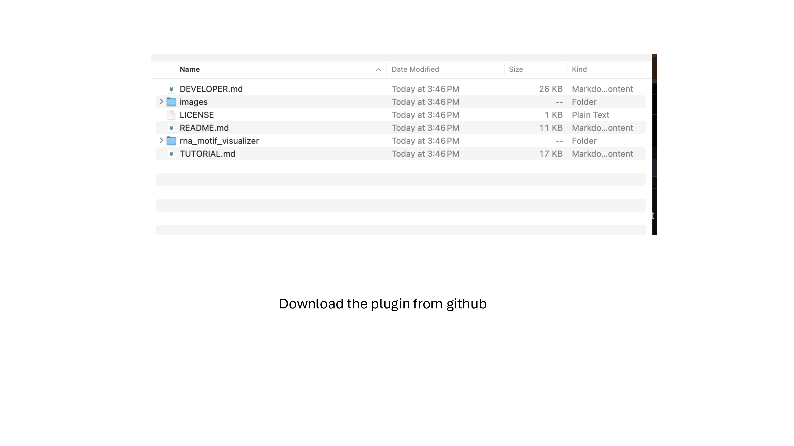
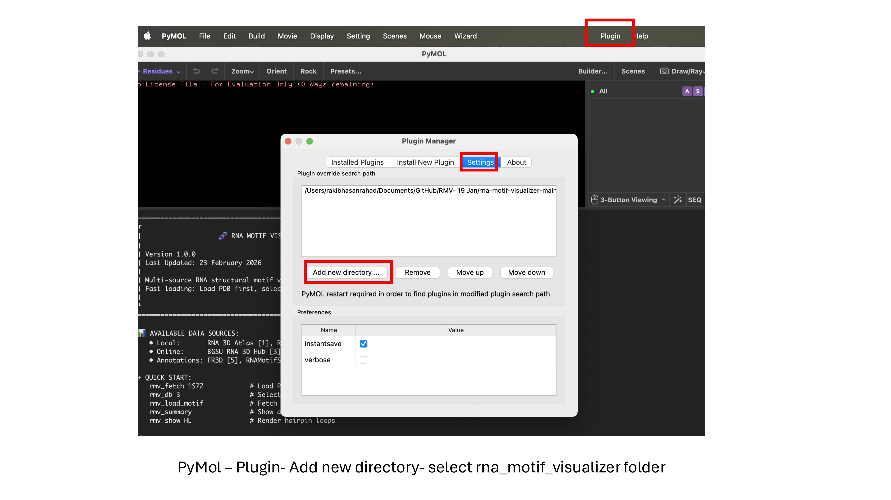
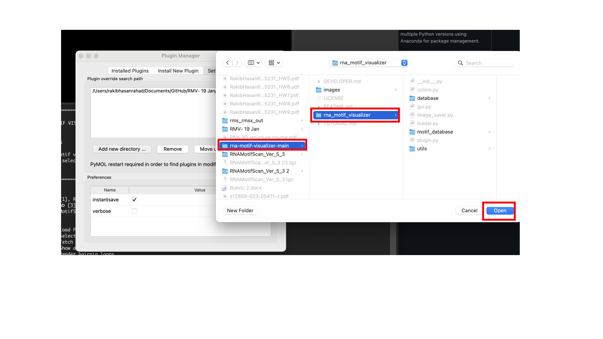
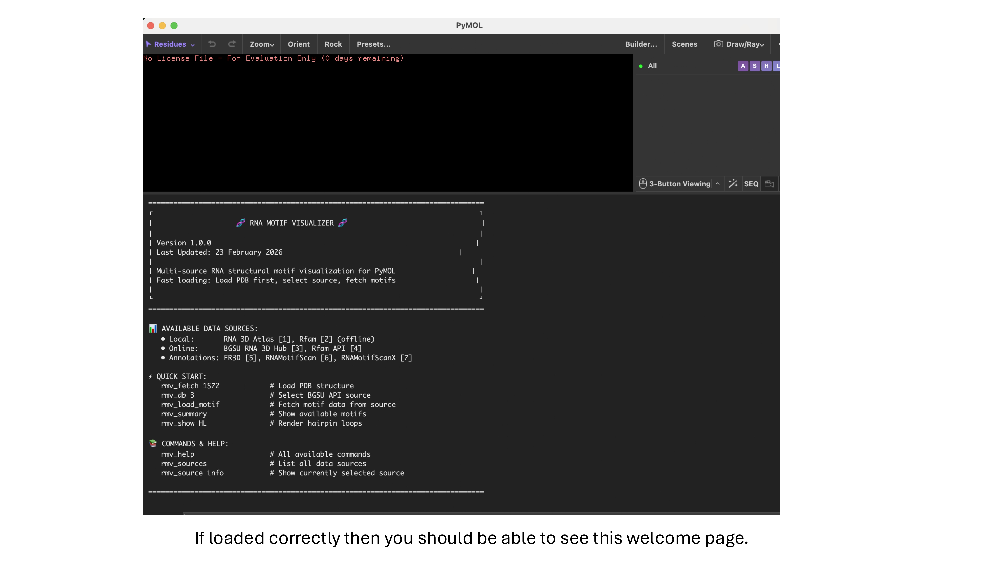

# RSMViewer — RNA Structural Motif Viewer

**A PyMOL plugin for automated visualization and comparative analysis of RNA structural motifs**

[](LICENSE)


---

## Overview

RSMViewer is a PyMOL plugin designed for structural biologists and computational RNA researchers. It automates the retrieval, standardization, visualization, and comparative analysis of RNA structural motifs. The plugin integrates multiple sources, including: BGSU RNA 3D Motif Atlas, Rfam, FR3D, RNAMotifScan (RMS), RNAMotifScanX (RMSX), and NoBIAS into a unified framework that standardizes heterogeneous motif annotations across formats, chain identifiers, and naming conventions, enabling automated visualization and comparative analysis within PyMOL.

**Key capabilities:**

- **Unified annotation retrieval** from 8 heterogeneous sources (2 locally integrated, 2 web API, 4 supporting annotation tool formats)
- **Automatic standardization** — chain ID harmonization (auth_asym_id ↔ label_asym_id), canonical motif naming, homolog-based enrichment, and P-value filtering
- **Multi-source cascade merge** with category-aware Jaccard deduplication and source attribution
- **Medoid-based structural superimposition** across single or multiple PDB structures
- **Batch export** of motif instances as high-resolution PNG images or  mmCIF files with original coordinates

---

## Installation

### Step 1: Download

```bash
git clone https://github.com/Rakib-Hasan-Rahad/rna-motif-visualizer.git
```

Or download the [ZIP file](https://github.com/Rakib-Hasan-Rahad/rna-motif-visualizer/archive/refs/heads/main.zip) and extract.

### Step 2: Install in PyMOL

1. Open **PyMOL**
2. Go to **Plugin → Plugin Manager**
3. Click the **Settings** tab
4. Click **Add new directory**
5. Navigate to and select the **`rsmviewer`** folder
6. Click **OK** and restart PyMOL

### Step 3: Verify Installation

After restarting PyMOL, you should see the welcome banner:

```
================================================================================
                    🧬 RSMViewer 🧬

 Version 1.0.0
 Last Updated: 02 April 2026
================================================================================
```

Run `rmv_help` at any time to see all available commands.




---

## Quick Start

### 1. See All Available Commands

```
rmv_help
```

### 2. Load a Structure & Visualize Motifs

```
rmv_fetch 1S72           # Step 1: Download 23S rRNA structure
rmv_sources              # Step 2: Check available data sources
rmv_db 3                 # Step 3: Select BGSU API source
rmv_load_motif           # Step 4: Fetch motif data
rmv_summary              # Step 5: Show motif types & counts
rmv_view all             # Step 6: Highlight all motifs on structure
rmv_summary HL           # Step 7: Show hairpin loop instances
rmv_show HL              # Step 8: Render all hairpin loops
rmv_show HL 1            # Step 9: Zoom to specific instance
```

### 3. Explore Individual Instances

```
rmv_summary GNRA         # See all GNRA instances
rmv_show GNRA 1          # Zoom to first GNRA instance
rmv_show GNRA 2          # Switch to second instance
```

### 4. Compare Data Sources

The PDB structure stays loaded while you switch sources:

```
rmv_db 3                 # BGSU API
rmv_load_motif           # Fetch from BGSU
rmv_db 4                 # Rfam API (no PDB re-download!)
rmv_load_motif           # Fetch from Rfam
```

### 5. Multi-Source Combine

```
rmv_db 8 7               # Combine NoBIAS + RMSX (left = highest priority)
rmv_load_motif           # Fetches from both, merges with deduplication
rmv_summary              # Unified summary with source attribution
rmv_show K-TURN nobias   # Show only NoBIAS-unique instances
rmv_show K-TURN shared   # Show only instances found in both sources
```

### 6. Structural Superimposition

```
rmv_super KTURN          # Medoid-based superimposition of all K-TURN instances
rmv_super KTURN 1,3,5    # Superimpose specific instances only
```

### 7. Export Images & Structures

```
rmv_save current         # Save high-res PNG of current view (2400×1800, ~300 DPI)
rmv_save ALL             # Batch export all motif instances as PNG
rmv_save ALL cif         # Export all motif instances as mmCIF
rmv_save HL cif          # Export all hairpin loop instances as mmCIF
rmv_save HL 3 cif        # Export HL instance #3 as mmCIF
```

> **Note:** mmCIF export extracts _original_ coordinates from the on-disk CIF file,
> not PyMOL's internal coordinates (which may be slightly modified). Each exported
> file is a standalone mmCIF that can be loaded independently in any molecular viewer.

---

## Complete Command Reference (22 Commands)

### Loading & Data Management

| Command | Description |
|---------|-------------|
| `rmv_fetch <PDB_ID>` | Fetch PDB structure from RCSB (no motif data) |
| `rmv_fetch /path/to/file.cif` | Load a local PDB or mmCIF file |
| `rmv_fetch <PDB_ID>, cif_use_auth=0` | Load with mmCIF label chain IDs |
| `rmv_fetch <PDB_ID>, bg_color=white` | Load with custom background color |
| `rmv_load_motif` | Fetch motif data from the currently selected source |
| `rmv_db <N>` | Select data source by ID (1–8) |
| `rmv_db <N1> <N2>` | Combine multiple sources (left = highest priority) |
| `rmv_db <N1> <N2>, jaccard_threshold=0.80` | Combine with custom merge threshold |
| `rmv_db <N> /path/to/data` | Set custom data path (sources 5–8, per-source) |
| `rmv_db <N> off` | Disable P-value filtering (sources 6–8) |
| `rmv_db <N> on` | Enable P-value filtering (sources 6–8) |
| `rmv_db <N> <MOTIF> <P-VALUE>` | Set custom P-value threshold (sources 6–8) |
| `rmv_sources` | List all 8 available sources with descriptions |
| `rmv_refresh` | Force re-fetch from API (bypass 30-day cache) |

### Visualization & Navigation

| Command | Description |
|---------|-------------|
| `rmv_show <TYPE>` | Create PyMOL objects for all instances of a motif type |
| `rmv_show <TYPE> <NO>` | Zoom to specific instance #NO |
| `rmv_show <TYPE> <NO1>,<NO2>,<NO3>` | Show multiple specific instances |
| `rmv_show <TYPE>, padding=N` | Expand residue ranges ±N for visualization context |
| `rmv_show <TYPE> <SOURCE>` | Filter by source in combine mode (nobias/rmsx/shared) |
| `rmv_show ALL` | Show all motif types with PyMOL objects |
| `rmv_view all` | Highlight all motif regions on structure (no objects created) |
| `rmv_view <TYPE>` | Highlight and zoom to motif regions |
| `rmv_view <TYPE> <NO>` | Highlight and zoom to specific instance |
| `rmv_view hide` | Reset all view coloring to gray |
| `rmv_view <TYPE> hide` | Reset coloring for a specific motif type |
| `rmv_view all hide` | Reset all view coloring (undo `rmv_view all`) |
| `rmv_toggle <TYPE> on/off` | Show/hide motif type visibility |
| `rmv_color <TYPE> <COLOR>` | Change motif color at runtime |
| `rmv_colors` | Display color legend |
| `rmv_bg_color <COLOR>` | Change background (non-motif) color |

### Structural Superimposition

| Command | Description |
|---------|-------------|
| `rmv_super <TYPE>` | Medoid superimposition — sequence-independent (`cmd.super`) |
| `rmv_super <TYPE> <NO1>,<NO2>,<NO3>` | Superimpose specific instances only |
| `rmv_super <TYPE>, padding=N` | Expand residue ranges ±N |
| `rmv_super <TYPE>, <PDB_SRC1>, <PDB_SRC2>` | Cross-PDB superimposition via PDB+source tags |
| `rmv_align <TYPE>` | Same as `rmv_super` but sequence-dependent (`cmd.align`) |

### Information & Diagnostics

| Command | Description |
|---------|-------------|
| `rmv_summary` | Show motif type counts |
| `rmv_summary <TYPE>` | Show all instances of a type with source attribution |
| `rmv_summary <TYPE> <NO>` | Show residue-level details for a specific instance |
| `rmv_chains` | Show chain IDs and CIF mode status |
| `rmv_loaded` | Show loaded PDB+source combination tags |
| `rmv_source info` | Show currently active source |
| `rmv_source info <N>` | Detailed info about source N |
| `rmv_help` | Full command reference |

### Image & Structure Export

| Command | Description |
|---------|-------------|
| `rmv_save current` | Export current PyMOL view as high-res PNG |
| `rmv_save current my_figure` | Export with custom filename |
| `rmv_save ALL` | Batch export all motif instances as PNG |
| `rmv_save ALL sticks` | Batch export with specific representation |
| `rmv_save <TYPE>` | Export all instances of a type as PNG |
| `rmv_save <TYPE> <NO> spheres` | Export specific instance with representation |
| `rmv_save ALL cif` | Export all motif instances as mmCIF |
| `rmv_save <TYPE> cif` | Export all instances of a type as mmCIF |
| `rmv_save <TYPE> <NO> cif` | Export specific instance as mmCIF |

### User Annotations

| Command | Description |
|---------|-------------|
| `rmv_user <TOOL> <PDB_ID>` | Load FR3D or RMS annotations directly |
| `rmv_user list` | List available annotation files |

### Utility

| Command | Description |
|---------|-------------|
| `rmv_reset` | Delete all objects and reset plugin to defaults |
| `rmv_load <PDB_ID>` | Legacy — prints the recommended workflow guide |

---

## Data Sources

RSMViewer provides 8 data sources organized in three categories:

### Online (Real-time API Access)

| ID | Source | Command | Coverage |
|----|--------|---------|----------|
| 3 | **BGSU RNA 3D Hub** | `rmv_db 3` | ~3000+ PDB structures (most comprehensive) |
| 4 | **Rfam API** | `rmv_db 4` | 34 named motif families (RM00001–RM00034) |

### Offline (Bundled, Pre-computed)

| ID | Source | Command | Motif Types |
|----|--------|---------|-------------|
| 1 | **RNA 3D Motif Atlas** | `rmv_db 1` | 7 types (HL, IL, J3–J7) |
| 2 | **Rfam Local** | `rmv_db 2` | 19 named motifs (GNRA, UNCG, K-TURN, T-LOOP, C-LOOP, etc.) |

### User-Provided (Custom Annotations)

| ID | Source | Command | P-Value Filtering |
|----|--------|---------|-------------------|
| 5 | **FR3D** | `rmv_db 5` | No |
| 6 | **RNAMotifScan (RMS)** | `rmv_db 6` | Yes |
| 7 | **RNAMotifScanX (RMSX)** | `rmv_db 7` | Yes |
| 8 | **NoBIAS** | `rmv_db 8` | Yes |

### Custom Data Paths (Per-Source, Independent)

Each user annotation source remembers its own custom path independently:

```
rmv_db 5 /path/to/fr3d/data       # FR3D with custom directory
rmv_db 6 ~/my_rms_data            # RMS with home-relative path
rmv_db 7 /path/to/rmsx/data       # RMSX with custom directory
rmv_db 8 /path/to/nobias/data     # NoBIAS with custom directory
```

> Setting a path for source 7 does **not** overwrite the path for source 8.

### P-Value Filtering (Sources 6–8)

RMS, RMSX, and NoBIAS include P-values in their output. The plugin filters results using default thresholds:

| Motif | RMS | RMSX | NoBIAS |
|-------|-----|------|--------|
| KINK-TURN | 0.07 | 0.066 | 0.066 |
| C-LOOP | 0.04 | 0.044 | 0.044 |
| SARCIN-RICIN | 0.02 | 0.040 | 0.040 |
| REVERSE KINK-TURN | 0.14 | 0.018 | 0.018 |
| E-LOOP | 0.13 | 0.018 | 0.018 |

```
rmv_db 6 off                # Disable filtering (show all results)
rmv_db 6 on                 # Re-enable filtering (use defaults)
rmv_db 6 SARCIN-RICIN 0.01  # Custom threshold for a specific motif
```

---

## User Annotation File Formats

### FR3D (Source 5)

CSV files placed in `rsmviewer/database/user_annotations/fr3d/`.

### RNAMotifScan (Source 6)

Tab-separated result files organized by motif type:

```
rsmviewer/database/user_annotations/RNAMotifScan/
├── c_loop/
│   └── Res_1s72
├── Kturn/
│   └── Res_1s72
├── sarcin_ricin/
│   └── Res_1s72
└── reverse_Kturn/
    └── Res_1s72
```

### RNAMotifScanX (Source 7)

Result files organized by consensus motif type:

```
rsmviewer/database/user_annotations/RNAMotifScanX/
├── c-loop_consensus/
│   └── result_0_100_withbs.log
├── k-turn_consensus/
│   └── result_0_100_withbs.log
└── sarcin-ricin_consensus/
    └── result_0_100_withbs.log
```

### NoBIAS (Source 8)

Flat directory with files named `<pdb>_<motif>_nobias.txt`:

```
rsmviewer/database/user_annotations/NoBIAS/
└── 1s72_k-turn_nobias.txt
```

Both RMSX and NoBIAS use the same tab-separated format:

```
#fragment_ID	aligned_regions	alignment_score	P-value
1S72_0:75-85_89-98_58-60	0:'0'77-4:'0'81,...	167	0.00639525
```

---

## Multi-Source Combine Pipeline

When you select multiple sources, the plugin enters **combine mode**:

```
rmv_db 8 7                 # NoBIAS (priority) + RMSX
rmv_load_motif             # Runs the full combine pipeline
```

### Pipeline Steps

1. **Fetch** — motifs are retrieved from each source independently
2. **Enrich** — generic names (HL, IL) are enriched to specific names (GNRA, C-LOOP) using NR homolog representative lookup
3. **Source stamp** — each instance is tagged with its source origin
4. **Within-source dedup** — exact duplicate entries within the same source are removed
5. **Cascade merge** — right-to-left merging with category-aware Jaccard deduplication (default threshold: 60% residue overlap)
6. **Cross-source attribution** — overlapping instances are tagged with `_also_found_in` metadata

### Source Priority

Sources listed first have **highest priority**. When two instances overlap (Jaccard ≥ threshold), the higher-priority version is kept:

```
rmv_db 8 7                 # NoBIAS (higher priority) + RMSX
rmv_db 1 3 4               # Atlas (highest) + BGSU + Rfam API (lowest)
```

### Custom Jaccard Threshold

```
rmv_db 8 7, jaccard_threshold=0.80    # 80% overlap required for deduplication
rmv_db 8 7, jaccard_threshold=40      # Values >1.0 treated as percentages
```

### Source Filtering in Combine Mode

After merging, use source filter keywords with `rmv_show` to render subsets:

```
rmv_show K-TURN nobias     # Only NoBIAS-unique instances
rmv_show K-TURN rmsx       # Only RMSX-unique instances
rmv_show K-TURN shared     # Only instances found in both sources
rmv_show K-TURN            # All instances (no filter)
```

Supported keywords: `nobias`, `rmsx`, `rms`, `fr3d`, `rfam`, `atlas`, `bgsu`, `shared`.

---

## Chain ID Handling

The plugin automatically handles both PDB and mmCIF chain ID conventions:

### Default Mode (auth_asym_id)

```
rmv_fetch 1S72          # Chains: 0, 9, A, B, ... (author-assigned)
```

### Label ID Mode (label_asym_id)

```
rmv_fetch 1S72, cif_use_auth=0    # Chains: A, AA, AB, ... (PDB-standardized)
```

When `cif_use_auth=0` is set, the plugin:

1. Sets PyMOL to use `label_asym_id` as the chain property
2. Parses the CIF file `_atom_site` loop to build an auth → label chain mapping
3. Automatically remaps motif data (which uses auth chains) to label chains

**Verify chain mode:**

```
rmv_chains
```

**Use label mode when:**
- Your annotation tool output uses label_asym_id chain identifiers
- You need PDB-standardized chain naming

---

## Structural Superimposition

The plugin implements medoid-based structural superimposition. The **medoid** is the instance with the lowest average RMSD to all other instances.

- **`rmv_super`** — uses `cmd.super()` (sequence-independent). Best for comparing the same motif across different organisms or PDB structures.
- **`rmv_align`** — uses `cmd.align()` (sequence-dependent). Best when motif sequences are similar.

```
rmv_super KTURN                 # All K-TURN instances
rmv_super KTURN 1,3,5           # Only instances 1, 3, 5
rmv_super KTURN, padding=3      # With ±3 flanking residues
```

### Cross-PDB Superimposition

```
rmv_fetch 1S72
rmv_db 3
rmv_load_motif

rmv_fetch 4V88
rmv_load_motif

rmv_super KTURN                       # All K-TURNs across both PDBs
rmv_super KTURN, 1S72_S3, 4V88_S3    # Filter by PDB+source tags
```

### Motif Name Aliasing

The commands resolve common name variants automatically:

| User Input | Resolves To |
|------------|-------------|
| `KTURN`, `K_TURN`, `KINK-TURN`, `KINK_TURN` | K-TURN |
| `CLOOP`, `C_LOOP` | C-LOOP |
| `SARCIN`, `SARCINRICIN`, `SARCIN_RICIN` | SARCIN-RICIN |
| `TLOOP`, `T_LOOP` | T-LOOP |
| `ELOOP`, `E_LOOP` | E-LOOP |
| `REVERSE-KTURN`, `REVERSE_KTURN`, `REVERSEKTURN` | REVERSE-K-TURN |

### Output

Each instance is colored uniquely (cycling through 15 distinct colors). The **medoid** is highlighted in **green**. A summary table is printed with per-instance RMSD values.

---

## Image & Structure Export

### PNG Export

Motif instances are rendered in isolation (no background structure) at 800×600:

```
rmv_save ALL                  # All instances, cartoon representation
rmv_save ALL sticks           # All instances, sticks
rmv_save HL                   # All HL instances
rmv_save HL 3 spheres         # HL instance 3, spheres
rmv_save current              # Current PyMOL view (2400×1800, ~300 DPI)
rmv_save current my_figure    # Custom filename
```

**Available representations:** `cartoon` (default), `sticks`, `spheres`, `ribbon`, `lines`, `licorice`, `surface`, `cartoon+sticks`

### mmCIF Export

Extracts original coordinates from the on-disk CIF file (not PyMOL's internal coordinates):

```
rmv_save ALL cif              # All motif instances
rmv_save HL cif               # All hairpin loop instances
rmv_save HL 3 cif             # HL instance #3
```

### Output Directories

```
plugin_directory/
├── motif_images/             # PNG exports
│   └── <pdb_id>/
│       └── <MOTIF_TYPE>/
│           └── <TYPE>-<NO>-<CHAIN>_<RESIDUES>.png
└── motif_structures/         # mmCIF exports
    └── <pdb_id>/
        └── <MOTIF_TYPE>/
            └── <TYPE>-<NO>-<CHAIN>_<RESIDUES>.cif
```

---

## Color System

### Default Color Assignments

| Motif Type | Default Color |
|-----------|---------------|
| HL (Hairpin Loop) | Red |
| IL (Internal Loop) | Cyan |
| J3 (3-Way Junction) | Yellow |
| J4 (4-Way Junction) | Magenta |
| J5 (5-Way Junction) | Green |
| J6 (6-Way Junction) | Orange |
| J7 (7-Way Junction) | Blue |
| GNRA | Teal Green |
| UNCG | Brown Orange |
| K-TURN | Bright Blue |
| SARCIN-RICIN | Dark Red |
| T-LOOP | Pink |
| C-LOOP | Sky Blue |
| U-TURN | Gold |

Motif types not in this table get a unique auto-assigned color from a pool of 20 visually distinct colors. If the pool is exhausted, a deterministic hash-based color is generated.

### Custom Colors

```
rmv_color HL blue            # Override hairpin loop color
rmv_color GNRA red           # Override GNRA color
rmv_bg_color white           # Change background (non-motif) color
rmv_colors                   # View current color legend
```

---

## Caching & Performance

API responses (sources 3 and 4) are cached for **30 days** at:

```
~/.rsmviewer_cache/
```

- Second load of the same structure: <1 second
- Offline access after first fetch
- `rmv_refresh` forces a fresh API call, bypassing the cache

**Manually clear cache:**

```bash
rm -rf ~/.rsmviewer_cache/
```

---

## Example Workflows

### Workflow 1: Basic Motif Exploration

```
rmv_fetch 1S72               # Load 23S rRNA
rmv_db 3                     # BGSU RNA 3D Hub (most comprehensive)
rmv_load_motif               # Fetch motif annotations
rmv_summary                  # See all motif types & counts
rmv_show GNRA                # Render all GNRA tetraloops
rmv_show GNRA 1              # Zoom to first instance
rmv_view all                 # Highlight all motif regions on structure
rmv_view all hide            # Reset coloring
```

### Workflow 2: Compare Two Annotation Tools

```
rmv_fetch 1S72
rmv_db 8 /path/to/nobias     # Set NoBIAS data path
rmv_db 7 /path/to/rmsx       # Set RMSX data path
rmv_db 8 7                   # Combine: NoBIAS (priority) + RMSX
rmv_load_motif               # Merge with Jaccard deduplication
rmv_summary K-TURN            # View attribution (unique/shared breakdown)
rmv_show K-TURN nobias        # Show NoBIAS-unique instances
rmv_show K-TURN shared        # Show shared instances
```

### Workflow 3: Cross-PDB Superimposition

```
rmv_fetch 1S72
rmv_db 7 /path/to/rmsx/1S72
rmv_load_motif

rmv_fetch 4V9F
rmv_db 7 /path/to/rmsx/4V9F
rmv_load_motif

rmv_loaded                   # Check tags: 1S72_S7, 4V9F_S7
rmv_super K-TURN             # Superimpose all K-TURNs across both PDBs
```

### Workflow 4: Generate Publication Figures

```
rmv_fetch 1S72
rmv_db 3
rmv_load_motif
rmv_show SARCIN-RICIN 1
rmv_save current my_figure    # 2400×1800 PNG, ~300 DPI
rmv_save SARCIN-RICIN sticks  # All instances as sticks
rmv_save SARCIN-RICIN cif     # Export structures as mmCIF
```

### Workflow 5: Validate Computational Predictions

```
rmv_fetch 1S72
rmv_db 5 /path/to/fr3d        # FR3D with custom data
rmv_load_motif                 # Load FR3D annotations
rmv_summary                    # Check detected motif types
rmv_show ALL                   # Visualize all predictions
rmv_save ALL                   # Batch export for report
rmv_save ALL cif               # Extract structures
```

---

## Project Structure

```
rna-motif-visualizer/
├── rsmviewer/
│   ├── __init__.py                  # Package init, version (1.0.0)
│   ├── plugin.py                    # PyMOL plugin entry point
│   ├── gui.py                       # Command handlers & GUI state (~4260 lines)
│   ├── loader.py                    # Rendering & visualization pipeline (~2060 lines)
│   ├── alignment.py                 # Medoid superimposition pipeline (~990 lines)
│   ├── colors.py                    # 90+ motif color definitions + custom overrides
│   ├── image_saver.py               # PNG export with 8 representations
│   ├── structure_exporter.py        # mmCIF export (original coordinates from disk)
│   ├── database/
│   │   ├── config.py                # SOURCE_ID_MAP (8 sources), PluginConfig
│   │   ├── base_provider.py         # ResidueSpec, MotifInstance, MotifType, BaseProvider ABC
│   │   ├── registry.py              # DatabaseRegistry — lazy provider loading
│   │   ├── atlas_provider.py        # RNA 3D Atlas JSON provider
│   │   ├── rfam_provider.py         # Rfam Stockholm/SEED provider
│   │   ├── bgsu_api_provider.py     # BGSU API — HTML scraping + CSV fallback
│   │   ├── rfam_api_provider.py     # Rfam API — REST endpoint for 34 motif families
│   │   ├── source_selector.py       # Smart source routing with fallback chain
│   │   ├── source_registry.py       # Source registry
│   │   ├── cascade_merger.py        # Multi-source merge with Jaccard dedup
│   │   ├── homolog_enricher.py      # NR representative lookup for enrichment
│   │   ├── cache_manager.py         # 30-day disk cache at ~/.rsmviewer_cache/
│   │   ├── converters.py            # Provider-specific format converters
│   │   ├── representative_set.py    # BGSU NR list loader
│   │   ├── nrlist_4.24_all.csv      # BGSU NR representative list
│   │   └── user_annotations/        # FR3D, RMS, RMSX, NoBIAS loaders
│   │       ├── user_provider.py     # Unified user annotation provider
│   │       ├── converters.py        # Format parsers (FR3D CSV, RMS/RMSX/NoBIAS tab-separated)
│   │       ├── fr3d/                # FR3D data files
│   │       ├── RNAMotifScan/        # RMS data (motif-type subdirectories)
│   │       ├── RNAMotifScanX/       # RMSX data (consensus subdirectories)
│   │       └── NoBIAS/              # NoBIAS data (flat files)
│   ├── motif_database/              # Offline bundled data
│   │   ├── RNA 3D motif atlas/      # Atlas JSON files (HL, IL, J3–J7)
│   │   └── Rfam motif database/     # Rfam Stockholm files (19 motif types)
│   └── utils/
│       ├── logger.py                # Console logging with colors
│       ├── parser.py                # PDB ID + selection string parsers
│       └── selectors.py             # 3-layer chain ID protection for PyMOL selections
├── README.md                        # This file — overview and quick start
├── TUTORIAL.md                      # Step-by-step walkthroughs with examples
├── DEVELOPER.md                     # Architecture and developer guide
├── CHANGELOG.md                     # Version history
└── LICENSE                          # MIT License
```

---

## Troubleshooting

| Problem | Solution |
|---------|----------|
| Plugin not appearing | Verify you selected the `rsmviewer` folder (not the parent directory) in Plugin Manager |
| No motifs found | Try `rmv_db 1` (local) or check the structure is in the PDB database |
| API errors | Check internet connection; try `rmv_db 1` or `rmv_db 2` (offline sources) |
| Slow first load | Normal — API call + caching; second load is instant |
| Chain ID mismatch | Use `rmv_fetch <ID>, cif_use_auth=0` for label chain ID mode |
| Wrong chain IDs in annotations | Verify auth vs. label chain convention with `rmv_chains` |
| Motif type not found | Check spelling with `rmv_summary`; aliases are supported (e.g., `KTURN` → `K-TURN`) |
| Source path not working | Use absolute paths; verify directory structure matches expected format |
| Stale cached data | Run `rmv_refresh` to bypass the 30-day cache |
| Reset session | `rmv_reset` clears all objects and resets plugin state |

---

## License

MIT License — see [LICENSE](LICENSE) file.

---

## Acknowledgments

- **BGSU RNA 3D Hub** — Comprehensive RNA motif annotations and structure database
- **Rfam Database** — Conserved RNA family and motif definitions
- **RNA 3D Motif Atlas** — RNA motif taxonomy and structure analysis
- **PyMOL** — Schrödinger, LLC; molecular visualization platform
- **RNAMotifScan, RNAMotifScanX, FR3D & NoBIAS** — Community tools for RNA motif annotation

---

## Support

- **Issues & Bug Reports:** [GitHub Issues](https://github.com/Rakib-Hasan-Rahad/rna-motif-visualizer/issues)
- **Questions:** Open a GitHub Discussion

---

*RSMViewer v1.0.0 — CBB LAB KU @Rakib Hasan Rahad*
